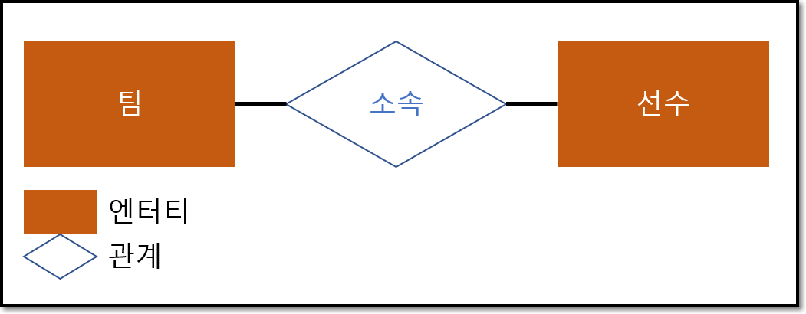

# [ 1장 ] SQL 기본

 - 본 문서의 SQL 예제의 벤더는 OracleDB를 기준으로 작성되었습니다.

## 1절 : 관계형 데이터베이스 개요

### 1. 데이터베이스
 - `넓은 의미` : 데이터베이스는 일상적인 정보들을 모아 놓은 것 자체를 의미한다. 그러나 일반적으로 데이터베이스라고 말 때는 특정 기업이나 조직 또는 개인이 필요에 의해 데이터를 일정한 형태로 저장해 놓은 것을 의미한다.

 - Example Case : 학교에서는 학생 관리를 목적으로 학생 개개인의 정보를 모아둘 것이고, 기업에서는 직원들을 관리하기 위해 직원들의 이름, 부서, 월급 등의 정보를 모아둘 것이다. 그리고 이러한 정보들을 관리하기 위해서 엑셀과 같은 소프트웨어를 이용하여 보기 좋게 정리하여 저장해 놓을 것이다.

  - 관리 대상이 되는 데이터의 양이 점점 많아지고 같은 데이터를 여러 사람이 동시에 여러 용도로 사용하게 되면서 단순히 엑셀 같은 개인이 관리하는 소프트웨어만으로는 한계에 부딪히게 된다.

 - 데이터가 손상되거나 유실되는 상황이 발생할 수도 있다.

 - 효율적인 데이터 관리 + 데이터 손상 대비 + 데이터 복구 등 기본적인 요구사항을 만족시켜주는 시스템 == DBMS(Database Management System)


#### 관계형 데이터베이스(Relational Database)
 - 1970년 영국의 수학자 E.F. Codd 박사의 논문에서 소개됨
- 이후 IBM의 SQL 개발단계를 거쳐 Oracle의 선발로 여러 회사에서 상용 제품이 나옴
 - 파일시스템 ---> 분산된 데이터 간의 정합성 유지에 과다한 노력이 필요
 - 정규화를 통한 합리적인 테이블 모델링을 통해 
    - 이상(ANOMALY) 현상을 제거
    - 데이터 중복 피함
    - 동시성 관리
    - 병행 제어
    - 많은 사용자들이 동시에 데이터를 공유 및 조작할 수 있는 기능 제공
 - DBMS는 인증된 사용자만이 참조할 수 있도록 보안기능 제공
 - 데이터 무결성(Integrity) 보장
     - 제약조건을 이용해 사용자가 실수로 조건에 위배되는 데이터를 입력하다든지, 관계를 연결하는 중요 데이터를 삭제하는 것을 방지)
---
### 2. SQL(Structured Query Language)
 - SQL은 RDMBS(관계형 데이터베이스)에서 `데이터 정의`, `데이터 조작`, `데이터 제어`를 하기위해 사용하는 언어
 - SQL의 최초 이름이 SEQUEL(Structured English QUEry Language)이었기 때문에 '시큐얼'로 읽는 경우도 있지만, 표준은 SQL이므로 '에스큐엘'로 읽는 것을 권고한다.
 - SQL 교육의 목표 = 정확한 데이터 출력
 - SQL 튜닝의 목적 = 시스템에 큰 영향을 주는 SQL을 가장 효과적(응답시간, 자원 활용 최소화)으로 작성하는 것이 목표
 - 1986년부터 ANSI/ISO를 통해 표준화되고 정의된 SQL 기능은 벤더별 DBMS 개발의 목표가 된다. 일부 구체적인 용어는 다르더라도 대부분의 관계형 데이터베이스에서 ANSI/ISO표준을 최대한 따르고 있기 때문에, SQL에 대한 지식은 다른 데이터베이스를 사용하더라도 상당 부분 기존 지식을 재활용할 수 있고, ANSI/ISO SQL-99, SQL-2003 이후 기준이 적용된 SQL이라면 프로그램의 이식성을 높이는 데도 공헌한다.

 #### SQL 문장의 종류

|명령어의 종류| 명령어 | 설명 |
|:---:|:---:|:---|
|DML|SELECT|데이터베이스에 들어 있는 데이터를 조회하거나 검색하기 위한 명령어를 말하는 것으로 RETRIEVE라고도 한다.|
|DML|INSERT<br>UPDATE<br>DELETE|데이터베이스의 테이블에 들어 있는 데이터에 변형을 가하는 종류의 명령어들을 말한다.|
|DDL|CREATE<br>ALTER<br>DROP<br>RENAME|테이블과 같은 데이터 구조를 정의하는데 사용되는 명령어들로 그러한 구조를 생성하거나 변경하거나 삭제하거나 이름을 바꾸는 데이터 구조와 관련된 명령어|
|DCL|GRANT<br>REVOKE|데이터베이스에 접근하고 객체들을 사용하도록 권한을 주고 회수하는 명령어|
|TCL|COMMIT<br>ROLLBACK|논리적인 작업의 단위를 묶어서 DML에 의해 조작된 결과를 작업단위(트랜잭션) 별로 제어하는 명령어|

*DML : 데이터 조작어(Data Manipulation Language)
*DDL : 데이터 정의어(Data Definition Langauge)
*DCL : 데이터 제어어(Data Control Langauge)
*TCL : 트랜젝션 제어어(Transaction Control Language)

---
### 3. TABLE


선수오 관련된 데이터를 저장할 때 모든 데이터를 하나의 테이블로 저장하지 않는다. 위 테이블을 보면 `<선수 테이블>`과 `<구단 테이블>`이라는 복수의 테이블로 분할하여 저장하고 있다. 분할된 테이블은 `칼럼(Column)`의 값에 의해 연결된다. 이렇게 분할하여 데이터 중복을 줄이는 것을 **정규화(Normalization)** 이라고 한다. 정규화는 데이터 정합성 확보와 데이터 입력/수정/삭제시 발생할 수 있는 *이상현상(Anomaly)* 을 방지하기 위한 관계형 데이터베이스 모델링에서 매우 중요한 프로세스이다.

---
### 4. ERD(Entity Relationship Diagram)

팀 정보와 선수 정보간에는 어떤 의미의 관계가 존재하며, 다른 테이블과도 어떤 의미의 연관성이나 관계를 가지고 있다. ERD는 이와 같은 관계의 의미를 직관적으로 표현할 수 있는 좋은 수단이다.

**ERD의 구성 요소**
 - 엔터티(Entity)
 - 관계(Relationship)
 - 속성(Attribute)

**테이블 관계 표현 방법**
 - IE(Information Engineering) 표기법
   - 실선 : 식별관계
   - 점선 : 비식별관계
 - Barker(Case*Method) 표기법
   - 수직바 : 식별관계

---

## 2절 : DDL

### 1. 데이터 유형
 - 특정 칼럼을 정의할 때 데이터 유형과 크기를 정해 실수 방지
 - ANSI/ISO 기준에서 정한 데이터 유형의 예로 NUMERIC Type의 하위 개념으로 아래 항목들을 소개한다.
    - NUMERIC
    - DECIMAL
    - DEC
    - SMALLINT
    - INTEGER
    - INT
    - BIGINT
    - FLOAT
    - REAL
    - DOUBLE PRECISION

>그러나 Oracle은 숫자형 타입에 대해서 NUMBER 한 가지 숫자 타입의 데이터 유형만 지원한다. 

 - 일반적으로 표준과 다른 용어를 사용하는 것은 현실적으로 허용한다.
   - NUMERIC ---> NUMBER
   - WINDOW FUNCTION ---> ANALYTIC / RANK FUNCTION

| 데이터 유형 | 설명 |
|:---:|:---|
|CHARACTER(s)| - 고정 길이 문자열 정보 (Oracle, SQL Server 모두 CHAR로 표현) <br> - s는 기본 길이 1바이트, 최대 길이 Oracle 2,000바이트, SQL Server 8,000바이트 <br> - s만큼 최대 길이를 갖고 고정 길이를 가지고 잇으므로 할당된 변수 값의 길이가 s보다 작을 경우에는 그 차이 길이 만큼 공간으로 채워진다.|
|VARCHAR(s)| - CHARACTER VARYING의 약자로 가변 길이 문자열 정보(Oracle은 VARCHAR2로 표현, SQL Server는 VARCHAR로 표현 <br> - s는 최소 길이 1바이트, 최대 길이 Oracle 4,000바이트, SQL Server 8,000바이트 <br> - s만큼 최대 길이를 갖지만 가변 길이로 조정이 되기 때문에 할당된 변수값의 바이트만 적용된다(Limit 개념)|
|NUMERIC| - 정수, 실수 등 숫자 정보(Oracle은 NUMBER로, SQL Server는 10가지 이상의 숫자 타입을 가지고 있음) <br> - Oracle은 처음에 전체 자리 수를 지정하고, 그 다음 소수 부분의 자리 수를 지정한다. 예를 들어 정수 부분이 6자리고 소수점 부분이 2자리인 경우에는 `NUMBER(8,2)`와 같이 된다.|
|DATE| - 날짜와 시각 정보 <br> - Oracle은 1초 단위, SQL Server는 3.33ms(millisecond) 단위 관리 | 

#### `CHAR` vs `VARCHAR`
 - 길이가 다양한 컬럼과, 정의된 길이와 실제 데이터 길이에 차이가 있는 칼럼 = `VARCHAR`
 - 비교 방법에서 차이가 있다.
```
예) CHAR 유형
'AA' = 'AA   '

>> 같음
```
```html
예) VARCHAR 유형
'AA' ≠ 'AA   '

>> 같지 않음
```
 - CHAR에서는 문자열을 비교할 때 공백을 채워서 비교하는 방법을 사용, 예를 들어 ``` 'AA' = 'AA  ' ```가 있을 때 짧은 쪽의 `'AA'`를 `'AA  '`로 공백을 채워 두 개의 데이터가 같은 길이가 되도록 만든 후 한글자씩 비교한다.

 - 주민등록번호와 같이 정해진 길이는 `CHAR`, 주소와 같이 정확히 얼마의 문자 길이를 사용할지 예측할 수 없으면 `VARCHAR` 사용

 - 잘못된 판단은 추후 ALTER TABLE 명령으로 정정할 수 있지만 데이터가 입력된 상황이라면 처리 과정이 쉽지 않다.

---
### 2. CREATE TABLE
```sql
CREATE TABLE 테이블이름(
    칼럼명1 DATATYPE [DEFAULT 형식],
    칼럼명2 DATATYPE [DEFAULT 형식],
    칼럼명3 DATATYPE [DEFAULT 형식], 
);
```
```sql
CREATE TABLE player(
    player_id CHAR(7) NOT NULL,
    player_name VARCHAR(20) NOT NULL, 
    team_id CHAR(3) NOT NULL,
    CONSTRAINT player_pk PRIMARY KEY (player_id),
    CONSTRAINT player_fk FOREIGN KEY (team_id) REFERENCES team(team_id)
);
```
 - 제약조건 종류

| 구분 | 설명 |
|:---:|:---|
|PRIMARY KEY<br>기본키| 테이블에 저장된 행 데이터를 고유하게 식별하기 위한 기본키 정의, DBMS는 자동으로 UNIQUE 인덱스를 생성, NULL 입력 불가<br>`기본키 제약 = 고유키 제약 & NOT NULL 제약` |
|UNIQUE KEY<br>고유키 | 테이블에 저장된 행 데이터를 고유하게 식별하기 위한 고유키 정의, NULL이 있을 수 있음 |
| NOT NULL | NULL 값 입력 금지, 해당 칼럼 입력은 필수라는 이야기 |
| CHECK | 입력할 수 있는 값의 범위 등을 제한, TRUE or FALSE로 평가할 수 있는 논리식 지정 |
| FOREIGN KEY<br>외래키 | 관계형 데이터베이스에서 테이블 간의 관계를 정의하기 위해 기본키를 다른 테이블의 외래키로 복사하는 경우 |

 - 생성된 테이블 구조 확인
```sql
DESC 테이블명
```
 - SELECT로 테이블 생성

CREATE TABLE ~ AS SELECT ~ 방법 [CTAS 방법]

`주의 사항` : 제약조건중에 NOT NULL만 새로운 복제 테이블에 적용이 되고, 기본키, 고유키, 외래키, CHECK 등의 다른 제약 조건은 없어진다. **제약 조건을 추가하기 위해서는 뒤에 나오는 `ALTER TABLE` 기능을 사용해야 한다**
```sql
CREATE TABLE team_temp
AS SELECT * FROM team;
```
---
### 3. ALTER TABLE
 - ADD COLUMN
```sql
ALTER TABLE 테이블명
ADD [추가할 칼럼명] [데이터 유형];
```
```sql
ALTER TABLE player
ADD (address VARCHAR2(80));
```
`주의 사항` : 새롭게 추가된 칼럼은 테이블의 마지막 칼럼이 되며 칼럼의 위치를 지정할 수는 없다.

 - DROP COLUMN
```sql
ALTER TABLE 테이블명
DROP COLUMN [삭제할 컬럼명];
```
```sql
ALTER TABLE player
DROP COLUMN address;
```

 - MODIFY COLUMN
```sql
ALTER TABLE 테이블명
MODIFY (칼럼명1   데이터 유형  [DEFAULT 식][NOT NULL],
        칼럼명2   데이터 유형 ...);
```
```sql
ALTER TABLE team_temp
MODIFY (orig_yyyy VARCHAR2(8) DEFAULT '20020129' NOT NULL);
```

 - RENAME COLUMN
```sql
ALTER TABLE 테이블명
RENAME COLUMN 변경해야할 칼럼명 TO 새로운 칼럼명;
```
```sql
ALTER TABLE player
RENAME COLUMN player_id TO temp_id
```

 - DROP CONSTRAINT
```sql
ALTER TABLE 테이블명
DROP CONSTRAINT 제약조건명;
```
```sql
ALTER TABLE player
DROP CONSTRAINT player_fk;
```

 - ADD CONSTRAINT
```sql
ALTER TABLE 테이블명
ADD CONSTRAINT 제약조건명 제약조건 (칼럼명);
```
```sql
ALTER TABLE player
ADD CONSTRAINT player_fk
FOREIGN KEY (team_id) REFERENCES team(team_id)
```

---
### 4. RENAME TABLE
```sql
RENAME 변경전 테이블명 TO 변경후 테이블명;
```
```sql
RENAME team TO team_backup;
```
---
### 5. DROP TABLE
```sql
DROP TABLE 삭제할 테이블명 [CASCADE CONSTRAINT];
```
```sql
DROP TABLE player;
```
DROP 명령어를 사용하면 테이블의 모든 데이터 및 구조를 삭제한다. CASCADE CONSTRAINT 옵션은 해당 테이블과 관계가 있었던 참조된느 제약조건에 대해서도 삭제한다는 것을 의미한다.

---
### 6. TRUNCATE TABLE
 - 테이블 자체가 삭제되는 것이 아니고, 해당 테이블에 들어있던 모든행들이 제거되고 저장 공간을 재사용하도록 해제한다. 테이블 구조를 완전히 삭제하기 위해서는 `DROP TABLE`를 사용한다.

```sql
TRUNCATE TABLE 테이블명;
```
```sql
TRUNCATE TABLE player;

DESC player;
테이블 구조 확인 가능
```
#### `TRUNCATE`와 `DELETE`
 - `DELETE TABLE`와 달리 `TRUNCATE TABLE`은 auto commit특성으로 인해 DML이 아니라 DDL로 분류되었다.
 - 시스템 활용 측면에서는 `DELETE TABLE`보다는 시스템 부하가 적은 `TRUNCATE TABLE`을 권고한다. 단 `TRUNCATE TABLE`의 경우 정상적인 복구가 불가능하므로 주의해한다.

---
## 3절 DML

### 1. INSERT
```sql
INSERT INTO 테이블명 (COLUMN_LIST)
VALUE (COLUMN_LIST에 넣을 VALUE_LIST);

INSERT INTO 테이블명
VALUE (전체 COLUMN_LIST에 넣을 VALUE_LIST);
```
```sql
INSERT INTO player(player_id, player_name, team_id, position, height, weight, back_no)
VALUE ('2002007','박지성','K07','MF',178,73,7);
```
 - 칼럼명이 정의되지 않은 경우 NULL값이 입력된다.
---

### 2. UPDATE
```sql
UPDATE 테이블명
SET 수정되어야 할 칼럼명 = 수정되기를 원하는 새로운 값;
```
```sql
UPDATE player
SET back_no = 99;

[ 480개의 행이 수정되었다. ]
```
 - 선수 테이블의 백넘버를 일괄적으로 99로 수정

### 3. DELETE
```sql
DELETE FROM 삭제를 원하는 정보가 들어있는 테이블명;
```
```sql
DELETE FROM player;

[ 480개의 행이 삭제되었다. ]
```

#### DDL - DML 처리 방식
 - DDL(CREATE, ALTER, RENAME, DROP) : auto commit
 - DML(INSERT, DELETE, SELECT) : 조작하려는 테이블을 메모리 버퍼에 올려놓고 작업하기 때문에 실시간으로 테이블에 영향을 미치는 것은 아니다. 따라서 버퍼에서 처리한 DML 명령어가 실제 테이블에 반영되기 위해서는 `COMMIT` 명령어를 입력하여 TRANSACTION을 종료해야 한다. `단, SQL Server는 DML도 auto commit이다.`
 - `TRUNCATE TABLE` : Oracle은 `ROLLBACK` 불가, SQL Server는 `ROLLBACK` 가능

---
### 4. SELECT
```sql
SELECT [ALL/DISTINCT] 보고 싶은 칼럼명, 보고 싶은 칼럼명...
FROM 해당 칼럼들이 들어있는 테이블명;
```
```sql
SELECT player_id, player_name, team_id, position, height, weight, back_no
FROM player;
```
 - ALL은 기본, 생략 가능
 - WILDCARD 사용하기 : *
 - DISTINCT를 사용하면 모두 데이터를 출력하는게 아니라 데이터 종류와 아직 미정인게 있다면 NULL까지 출력된다.
```sql
SELECT DISTINCT position
FROM player;

[실행 결과]
POSITION
------------
GK
DF
FW
MF
5개의 행이 선택되었다.
```
 - ALIAS 부여하기
```sql
SELECT player_name AS 선수명, position AS 위치, height AS 키, weight AS 몸무게
FROM player;
```
`AS`를 꼭 사용하지 않아도 된다. 생략 가능~ <br>
중간 중간 공백이 들어가면 `" "`를 사용해야 한다.

---

### 5. 산술 연산자와 합성 연산자

 - 산술 연산자

| () | * | / | + | - |
|:---:|:-:|:-:|:-:|:-:|

 - 합성(CONCATENATION) 연산자

문자와 문자를 연결하는 합성 연산자를 사용하면 별도의 프로그램 도움 없이도 SQL 문장만으로도 유용한 리포트를 출력할 수 있다.

1. 오라클은 수직 바( || ), SQL Server는 +에 의해 이루어짐

2. 두 벤더 모두 공통적으로 CONCAT(string1, string2) 함수 사용 가능

```sql
SELECT player_name || '선수,' || height || 'cm, ' || weight || 'kg' 체격정보
FROM player;

[실행 결과]
체격정보
정경량선수,173cm,65kg
정은익선수,176cm,63kg
안대현선수,179cm,79kg
```

---
## 4절 : TCL ( TRANSACTION CONTROL LANGAUGE )

### 1. 트랜잭션 개요
 - 트랜잭션은 데이터베이스의 논리적 연산단위이다. 하나의 트랜잭션에는 하나 이상의 SQL 문장이 포함된다.

  - 트랜잭션은 분할할 수 없는 최소의 단위이다. 그렇기 때문에 전부 적용하거나 전부 취소한다.
     - `ALL` or `NOTHING`

  - 올바르게 반영된 데이터를 DB에 반영시키는 것 = `COMMIT`
  - 트랜잭션 시작 이전의 상태로 되돌리는 것 = `ROLLBACK`
  - 저장점 기능 = `SAVEPOINT`
  - SELECT 문장은 직접적인 트랜잭션의 대상이 아니지만 SELECT FOR UPDATE 등 배타적 LOCK을 요구하는 SELECT 문장은 트랜잭션 대상이 될 수 있다.

#### 트랜잭션의 특성
 - 원자성(atomicity) : all or nothing
 - 일관성(consistency) : 트랜잭션 실행 이후에도 DB 내용에 잘못이 있으면 안된다.
  - 고립성(isolation) : 트랜잭션 실행 도중 다른 트랜잭션의 영향을 받아 잘못된 결과를 만들어선 안된다.
 - 지속성(durability) : 트랜잭션이 성공적으로 수행되면 그 트랜잭션이 갱신한 데이터베이스의 내용은 영구적으로 저장된다.

---
### 2. COMMIT
 - 트랜잭션 완료하는 명령어
```sql
COMMIT;
```
 - 데이터에 대한 변경 사항이 데이터베이스에 반영
 - 이전데이터는 영원히 잃어버림
  - 모든 사용자는 결과를 볼 수 있다.
  - 관련된 행에 대한 잠금(LOCKING)이 풀리고, 다른 사용자들이 행을 조작할 수 있게 된다.

---
### 3. ROLLBACK
```sql
ROLLBACK;
```

---
### 4. SAVEPOINT
 - ROLLBACK을 할 때 트랜잭션에 포함된 전체 작업을 롤백하는 것이 아니라 현 시점에서 SAVEPOINT까지 트랜잭션만 롤백하고 실패한 부분에 대해서만 다시 실행할 수 있다.
 - 복수 저장점 정의 가능
 - 동일한 저장 이름이면 나중에 정의한 저장점이 유효하다.

```sql
SAVEPOINT svpt1;
ROLLBACK TO svpt1;
```
---
## 5절 : WHERE 절
### 1. WHERE 조건절 개요
 - 두 개 이상의 테이블에 대한 조인 조건을 기술하거나 결과를 제한하기 위한 조건을 기술할수도 있다.
 - 현실의 데이터베이스는 많은 사용자나 프로그램들이 동시에 접속하여 다량의 트랜잭션을 발생하고 있다. WHERE 조건절을 사용하지 않고 필요 없는 많은 자료들을 데이터베이스로부터 요청하는 SQL 문장은 대량의 데이터를 검색하기 위해 데이터베이스가 설치되어 있는 서버의 CPU나 MEMORY와 같은 시스템 자원(Resources)들을 과다하게 사용한다.
 - 또한 query에 대해 바로바로 처리를 해주지 못하게 된다.
 - 또한 검색된 많은 자료들이 네트워크를 통해 전달됨으로 문제점을 발생시킨다.

 - 이러한 문제점을 방지하기 위해 WHERE 절에 조건이 없는 FTS(Full Table Scan)문장은 SQL 튜닝의 1차 검토 대상이 된다.

  - 그렇다고 FTS가 무조건 나쁜 것은 아니다. 병렬 처리 등을 이용해 유용하게 사용하는 경우도 많다.

```sql
SELECT [DISTINCT/ALL] 칼럼명 [ALIAS명]
FROM 테이블명
WHERE 조건식;
```

---
### 2. 연산자의 종류

| 구분 | 연산자 | 연산자의 의미 |
|:---:|:---:|:---|
|비교연산자|`=`|같다.| 
|  |`>`|보다 크다.|
|  |`>=`|보다 크거나 같다.|
|  |`<`|보다 작다.|
|  |`<=`|보다 작거나 같다.|
|SQL연산자 |`BETWEEN a AND b`|a와 b의 값 사이에 있으면 된다(a와 b값이 포함됨)|
|  |`IN (list)`|리스트에 있는 값 중에서 어느 하나라도 일치하면 된다.|
|  |`LIKE '비교문자열'`|비교문자열과 형태가 일치하면 된다.(%, _ 사용)|
|  |`IS NULL`|NULL 값인 경우|
| 논리연산자|`AND`|AND 연산|
|  |`OR`|OR 연산|
|  |`NOT`|뒤에 오는 조건에 반대되는 결과를 되돌려줌|
| 부정비교연산자|`!=`|같지 않다.|
|  |`^=`|같지 않다.|
|  |`<>`|같지 않다.(ISO 표준, 모든 운영체제에서 사용 가능)|
|  |`NOT 칼럼명 =`|~와 같지 않다.|
|  |`NOT 칼럼명 >`|~보다 크지 않다.|
| 부정SQL연산자 |`NOT BETWEEN a AND b`|a와 b의 값 사이에 있지 않다. (a, b 값을 포함하지 않는다)|
|  |`NOT IN (list)`|list 값과 일치하지 않는다.|
|  |`IS NOT NULL`|NULL 값을 갖지 않는다.|

---
### 3. 비교 연산자

 - 문자 유형 비교 방법

| 구분 | 비교 방법 |
|:---:|:---|
| 비교 연산자의 양쪽이 모두 CHAR 유형 타입인 경우 | 길이가 서로 다른 CHAR형 타입이면 작은 쪽에 [SPACE]를 추가하여 같게 한 후에 비교한다.|
| |서로 다른 문자가 나올때까지 비교한다.|
| | 달라진 첫번째 문자의 값에 따라 크기를 결정한다. |
| | BLANK의 수만 다르다면 서로 같은 값으로 결정한다.
| 비교 연산자의 어느 한쪽이 VARCHAR 유형 타입인 경우 | 서로 다른 문자가 나올 때까지 비교한다.|
| | 길이가 다르다면 짧은 것이 끝날때까지만 비교한 후에 길이가 긴 것이 크다고 판단한다. |
| | 길이가 같고 다른 것이 없다면 같다고 판단한다. |
| | VARCHAR는 NOT NULL까지 길이를 말한다.
| 상수값과 비교할 경우 | 상수 쪽을 변수 타입과 동일하게 바꾸고 비교한다.|
| | 변수 쪽이 CHAR 유형 타입이면 위의 CHAR 유형 타입의 경우를 적용한다. |
| | 변수 쪽이 VARCHAR 유형 타입이면 위의 VARCHAR 유형 타입의 경우를 적용한다. |

```sql
SELECT player_name 선수이름, position 포지션, height 키
FROM player
WHERE height >= 170;
```
---
### 4. SQL 연산자
 - IN (list) 연산자

```sql
SELECT *
FROM player
WHERE team_id IN ('K02','K07')
```
'K02'나 'K07' 중에 어느 하나라도 일치하면 된다.

 - LIKE 연산자

장씨 성을 가진 사람 조회하기
```sql
SELECT *
FROM player
WHERE player_name LIKE '장%';
```
| 와일드카드 | 설명 |
|:---:|:---|
|`%`| 0개 이상의 어떤 문자를 의미한다. |
|`_`| 1개인 단일 문자를 의미한다. |

 - BETWEEB a AND b 연산자

```sql
SELECT *
FROM player
WHERE height BETWEEN 170 AND 180;
```

 - IS NULL 연산자
 
NULL은 `''`도 아니고 `0`도 아닌 비교 자체가 불가한 값
```sql
SELECT *
FROM player
WHERE position = NULL;
```
즉, 위와 같은 것은 무조건 FALSE로 나올 것이다.

아래와 같이 하자
```sql
SELECT *
FROM player
WHERE position IS NULL;
```
---
### 5. 논리 연산자

 - AND, OR, NOT

```sql
SELECT *
FROM player
WHERE team_id IN ('K02','K07')
AND position='MF';
```
 - 순서를 주의하자

---

### 6. 부정 연산자
```sql
SELECT *
FROM player
WHERE team_id = 'K02'
AND NOT position = 'MF'
AND NOT height BETWEEN 175 AND 185;
```

---

### 7. ROWNUM, TOP 사용

 - `ROWNUM`

오라클의 ROWNUM은 칼럼과 비슷한 성격의 Pseudo Column으로써 SQL 처리 결과 집합의 각 행에 대해 임시로 부여되는 일련번호이며, 테이블이나 집합에서 원하는 만큼의 행만 가져오고 싶을 때 WHERE 절에서 행의 갯수를 제한하는 목적으로 사용된다.

```sql
SELECT *
FROM player
WHERE ROWNUM <= 5;
```

다음과 같이 활용할 수도 있다.
```sql
UPDATE my_table
SET column1 = ROWNUM;
```
테이블 내의 고유한 키나 인덱스 값을 만들 수 있다.

 - `TOP`

SQL Server의 `ROWNUM`이다.

---

## 6절 : 함수(FUNCTION)

### 1. 내장 함수(BUILT-IN FUNCTION) 개요

#### 함수의 종류
 - 벤더에서 제공한는 함수인 **내장 함수** 
 - 사용자가 정의할 수 있는 **사용자 정의 함수(User Defined Function)**

#### 내장 함수
  - 단일행 함수(Single-Row Function) : 함수의 입력 값이 단일행 값이 입력됨

  - 다중행 함수(Multi-Row Function) : 여러 행의 값이 입력됨

#### 단일행 함수의 종류

|종류|내용|함수의 예|
|:---:|:---|:---|
|문자형 함수| 문자를 입력하면 문자나 숫자 값을 반환한다 | LOWER, UPPER, SUBSTR/SUBSTRING, LENGTH/LEN, LTRIM, RTRIM, TRIM, ASCII |
|숫자형 함수| 숫자를 입력하면 숫자 값을 반환한다 | ABS, MOD, BOUND, TRUNC, SIGN, CHR/CHAR, CEIL/CEILING, FLOOR, EXP, LOG, LN, POWER, SIN, COS, TAN |
|날짜형 함수| DATE 타입의 값을 연산한다 | SYSDATE/GETDATE, EXTRACT/DATEPART, TO_NUMBER(TO_CHAR(d,'YYYY'\|'MM'\|'DD')) / YEAR\|MONTH\|DAY |
|변환형 함수| 문자, 숫자, 날짜형 값의 데이터 타입을 변환한다 | TO_NUMBER, TO_CHAR, TO_DATE, / CAST, CONVERT |
|NULL 관련 함수|NULL을 처리하기 위한 함수|NVL/ISNULL, NULLIF, COALESCE |

#### 단일행 함수의 중요한 특징
 - SELECT, WHERE, ORDER BY 절에 사용 가능하다.
 - 가 행(Row)들에 대해 개별적으로 작용
 - 여러 인자를 입력해도 하나의 결과만 리턴
 - 특별한 경우가 아니면 인자에 함수를 사용하는 함수 중첩 가능

---
### 2. 문자형 함수

#### 단일행 문자형 함수의 종류

| 문자형 함수 | 함수 설명 |
|:---:|:---|
|LOWER(문자열)|문자열의 알파벳 문자를 소문자로 바꾸어 준다 |
|UPPER(문자열)|문자열의 알파벳 문자를 대문자로 바꾸어 준다|
|ASCII(문자)|문자나 숫자를 ASCII 코드 번호로 바꾸어 준다|
|CHR/CHAR(ASCII번호)|ASCII코드 번호를 문자나 숫자로 바꾸어 준다|
|CONCAT(문자열1, 문자열2)|Oracle, MySQL에서 유효한 함수, 문자열1과 문자열2를 연결한다. 합성 연산자 '\|\|'(Oracle)나 '+'(SQL Server)와 동일하다|
|SUBSTR/SUBSTRING(문자열, m[, n])|문자열 중 m위치에서 n개의 문자 길이에 해당하는 문자를 돌려준다. n이 생략되면 마지막 문자까지이다 |
|LENGTH/LEN(문자열)| 문자열의 개수를 숫자값으로 돌려준다.|
|LTRIM(문자열 [, 지정문자])|문자열의 첫 문자부터 확인해서 지정문자가 나타나면 해당 문자를 제거한다. 지정문자가 생략이면 공백 값이 Default... SQL Server는 공백만 제거 가능|
|RTRIM(문자열 [, 지정문자]) | 이건 문자열의 마지막 문자부터 |
|TRIM([leading\|trailing\|both] 지정문자 FROM 문자열)|문자열에서 머릿말, 꼬리말, 또는 양쪽에 있는 지정 문자를 제거한다. Default=both, SQL Server는 공백만 제거 가능 |

#### TIP 방출
 - 어떤 테이블이 있는지 확인
```sql
SELECT *
FROM tab;
```
 - DUMMY 테이블 : DUMMY라는 문자열 유형의 칼럼에 'X'라는 값이 들어있는 행을 1건 포함하고 있다.
```sql
SELECT LENGTH('SQL Expert')
FROM dual;
```
```sql
DESC dual;

칼럼                 NULL 가능           데이터유형
----------------   -------------    --------------
DUMMY                                  VARCHAR2(1)
```
---
### 3. 숫자형 함수

#### 단일행 숫자형 함수 종류
|숫자형 함수|함수 설명|
|:---:|:---|
|ABS(숫자)|숫자의 절대값을 돌려준다|
|SIGN(숫자)|숫자가 양수인지, 음수인지 0인지를 구별한다|
|MOD(숫자1, 숫자2)| 숫자1을 숫자2로 나누어 나머지 값을 리턴한다. MOD 함수는 % 연산자로도 대체 가능함|
|CEIL/CEILING(숫자)|숫자보다 크거나 같은 최소 정수를 리턴|
|FLOOR(숫자)|숫자보다 작거나 같은 최대 정수 리턴|
|ROUND(숫자 [, m])|숫자를 소수점 m+1자리에서 반올림하여 리턴한다. m이 생략되면 Default=0|
|TRUNC(숫자 [, m])|숫자를 소수 m+1자리에서 잘라서 버린다. m이 생략되면 Default=0, SQL Server에선 없다 |
|SIN, COS, TAN... | 숫자의 삼각함수 값을 리턴|
|EXP(), POWER(), SQRT(), LOG(), LN|숫자의 지수, 거듭 제곱, 제곱근, 자연 로그 값을 리턴 |

---
### 4. 날짜형 함수


#### 단일행 날짜형 함수 종류
Oracle 함수 / SQL Server 함수

|날짜형 함수|함수 설명|
|:---:|:---|
|SYSDATE() / GETDATE()|현재 날짜와 시각을 출력|
|EXTRACT('YEAR'\|'MONTH'\|'DAY' from d) / <br> DATEPART('YEAR'\|'MONTH'\|'DAY',d) | 날짜 데이터에서 년/월/일 데이터를 출력할 수 있다. 시간/분/초도 가능함|
|TO_NUMBER(TO_CHAR(d,'YYYY')) / YEAR(d), <br> TO_NUMBER(TO_CHAR(d,'MM')) / MONTH(d), <br> TO_NUMBER(TO_CHAR(d,'DAY')) / DAY(d), <br> | 날짜 데이터에서 년/월/일 데이터를 출력할 수 있다. Oracle EXTRACT YEAR/MONTH/DAY 옵션이나 SQL Server DEPART YEAR/MONTH/DAY 옵션과 같은 기능이다. TO_NUMBER 함수 제외시 문자형으로 출력된다.|

#### 단일행 날짜형 데이터 연산
|연산|결과|설명|
|:---:|:---:|:---|
|날짜 + 숫자|  날짜 | 숫자만큼의 날수를 날짜에 더한다|
|날짜 - 숫자| 날짜 | 숫자만큼의 날수를 날짜에서 뺀다|
|날짜1 - 날짜2 | 날짜수 | 다른 하나의 날짜에서 하나의 날짜를 빼면 일수가 나온다 |
|날짜 + 숫자/24| 날짜 | 시간을 날짜에 더한다 |

---

### 5. 변환형 함수

#### 데이터 유형 변환의 종류
 - 명시적(Explicit) 데이터 유형 변환

데이터 변환형 함수로 데이터 유형을 변환하도록 명시해 주는 경우

 - 암시적(Implicit) 데이터 유형 변환

데이터베이스가 자동으로 데이터 유형을 변환하여 계산하는 경우

```
암시적 데이터 유형 변환의 경우 성능 저하가 발생할 수 있음
자동으로 알아서 계산하지 않은 경우도 있음
명시적 데이터 유형 변환 방법 사용이 바람직함
```

#### 단일행 변환형 함수의 종류
| 변환형 함수 - Oracle | 함수 설명 |
|:---:|:---|
|TO_NUMBER(문자열) | alpanumeric 문자열을 숫자로 변환한다. |
|TO_CHAR(숫자\|날짜 [, FORMAT])|숫자나 날짜를 주어진 FORMAT 형태로 문자열 타입으로 변환한다.|
|TO_DATE(문자열, [, FORMAT])|문자열을 주어진 FORMAT 형태로 날짜 타입으로 변환한다.|

---

6. CASE 표현

CASE 표현은 IF-THEN-ELSE 논리와 유사한 방식으로 표현식을 작성해서 SQL의 비교 연산 기능을 보완하는 역할을 한다.

```sql
SELECT ename, CASE WHEN sal > 2000
                   THEN sal
                   ELSE 2000
              END  revised_salary
FROM emp;
```
*결과*
```
ENAME                REVISED_SALARY
-------------------- --------------
SMITH                          2000
ALLEN                          2000
WARD                           2000
JONES                          2975
MARTIN                         2000
BLAKE                          2850
CLARK                          2450
SCOTT                          3000
KING                           5000
TURNER                         2000
ADAMS                          2000
```

CASE 표현을 하기 위해서 조건절을 표현하는 2가지 방법이 있고, Oracle의 경우 DECODE 함수를 사용할 수도 있다.

#### 단일행 CASE 표현의 종류
| CASE 표현 | 함수 설명 |
|:---|:---|
|CASE<br>&nbsp;&nbsp;&nbsp;&nbsp;SIMPLE_CASE_EXPRESSION<br>&nbsp;&nbsp;&nbsp;&nbsp;ELSE 표현절<br>END| SIMPLE_CASE_EXPRESSION 조건이 맞으면 SIMPLE_CASE_EXPRESSION 조건내의 THEN 절을 수행하고, 조건이 맞지 않으면 ELSE 절을 수행한다.|
|CASE<br>&nbsp;&nbsp;&nbsp;&nbsp;SEARCHED_CASE_EXPRESSION 조건<br>&nbsp;&nbsp;&nbsp;&nbsp;ELSE 표현절<br>END|SEARCHED_CASE_EXPRESSION 조건이 맞으면 SEARCHED_CASE_EXPRESSION 조건내의 THEN 절을 수행하고, 조건이 맞지 않으면 ELSE 절을 수행한다. |
|DECODE(표현식, 기준값1, 값1 [, 기준값2, 값2,...,디폴트값])|Oracle에서만 사용되는 함수로, 표현식의 값이 기준값1이면 값1을 출력하고, 기준값2이면 값2를 출력한다. 그리고 기준값이 없으면 디폴트 값을 출력한다. CASE 표현의 SIMPLE_CASE_EXPRESSION 조건과 동일하다.|

 - EQUI(=) 조건만 사용한다면 `SIMPLE_CASE_EXPRESSION`이 더 간단하다.
```sql
SELECT loc, CASE LOWER(loc)
            WHEN 'new york' THEN 'east'
            WHEN 'boston'   THEN 'east'
            WHEN 'chicago'  THEN 'center'
            WHEN 'dallas'   THEN 'center'
            ELSE 'etc'
            END area
FROM dept;
```
*결과*
```
LOC                        AREA
-------------------------- ------------
NEW YORK                   east
DALLAS                     center
CHICAGO                    center
BOSTON                     east
```
 - 두번째로 `SEARCHED_CASE_EXPRESSION`은 CASE 다음에 칼럼이나 표현식을 표시하지 않고 다음 `WHEN절`에서 여러 조건을 이용해 다양한 조건을 적용할 수 있다.

```sql
SELECT ename, CASE WHEN sal >= 3000 THEN 'HIGH'
                   WHEN sal >= 1000 THeN 'MID'
                   ELSE 'LOW'
              END  AS   salary_grade
FROM emp;
```
`AS`는 생략해도 된다.

*결과*
```
ENAME                SALARY_GRADE
-------------------- --------
SMITH                LOW
ALLEN                MID
WARD                 MID
JONES                MID
MARTIN               MID
BLAKE                MID
CLARK                MID
SCOTT                HIGH
KING                 HIGH
TURNER               MID
ADAMS                MID
```

---

### 7. NULL 관련 함수
 - NOT NULL, PRIMARY KEY 제약조건을 제외한 모든 데이터 유형은 NULL 값을 포함할 수 있고, NULL은 공백도 숫자도 아니다. 0은 숫자고 공백은 하나의 문자이다.
 - 그러므로 NULL을 다룰 때는 NULL 관련 함수를 이용해야 한다.

아무 데이터가 없으면 0으로 취급하고 산술계산을 하고 싶은 경우
```sql
SELECT NULL+3 FROM dual;
```
*결과*
```
(null)
```
3을 기대했지만 결과는 (null)이다. 

#### 단일행 NULL 관련 함수의 종류

`Oracle / SQL Server`

| 일반형 함수 | 함수 설명 |
|:---|:---|
|NVL(표현식1, 표현식2) / ISNULL(표현식1, 표현식2)| 표현식1의 결과값이 NULL이면 표현식2의 값으로 출력한다. 단, 표현식1과 표현식2의 결과 데이터 타입이 같아야 한다.|
|NULLIF(표현식1,표현식2)| IF 표현식1 == 표현식2 <br>THEN return null<br>ELSE return 표현식1|
|COALESCE(표현식1, 표현식2, ...) | 임의의 개수 표현식에서 NULL 아닌 최초의 표현식을 나타낸다. 모든 표현식이 NULL이라면 NULL을 리턴한다.|

 - NVL(표현식1, 표현식2)

```sql
SELECT NVL(NULL, 'NVL-OK') NVL_TEST
FROM DUAL;
```
*결과*
```
NVL_TEST
------------
NVL-OK
```
아래와 같이 CASE 문으로도 표현할 수 있다.
```sql
SELECT ename, CASE  WHEN comm IS NULL
                    THEN '없음'
                    ELSE comm
              END AS comm
FROM emp;
```
*결과*
```
ORA-00932: 일관성 없는 데이터 유형: CHAR이(가) 필요하지만 NUMBER임
00932. 00000 -  "inconsistent datatypes: expected %s got %s"
*Cause:    
*Action:
3행, 29열에서 오류 발생
```
에러가 난 이유는 comm는 `NUMBER` 타입인데 THEN을 보면 `'없음'`이란 문자를 입력해서 그렇다. 타입이 일치하지 않다는 것이다.

```sql
SELECT ename, CASE  WHEN comm IS NULL
                    THEN 0
                    ELSE comm
              END AS comm
FROM emp;
```
이제 정상적으로 결과가 나온다.
 - NULL과 다른 개념인 공집합

조건에 맞는 데이터가 한 건도 없을 때
```sql
SELECT *
FROM emp
WHERE 1 = 2;
```
 - COALESCE()

인수의 숫자가 한정되어 있지 않으며, NULL이 아닌 최초의 EXPR을 나타낸다. 만일 모든 값이 NULL이라면 NULL을 리턴한다. `중첩CASE문`으로 표현할 수도 있다.

---
## 7절 : GROUP BY, HAVING 절

### 1. 집계 함수(Aggregate Function)

#### 집계 함수의 종류

| 집계 함수 | 사용 목적 | 
|:---|:---|
|COUNT(*)|NULL 값을 포함한 행의 수를 출력한다.|
|COUNT(표현식)|표현식의 값이 NULL 값인 것을 제외한 행의 수를 출력한다.|
|SUM([DISTINCT \| ALL] 표현식)|표현식의 NULL 값을 제외한 합계를 출력한다.|
|AVG([DISTINCT \| ALL] 표현식)|표현식의 NULL 값을 제외한 평균을 출력한다.|
|MAX([DISTINCT \| ALL] 표현식)| 표현식의 최대값을 출력한다.(문자, 날짜 데이터 타입도 사용가능)|
|MIN([DISTINCT \| ALL] 표현식)| 표현식의 최소값을 출력한다.(문자, 날짜, 데이터 타입도 사용가능)|
|STDDEV([DISTINCT \| ALL] 표현식)| 표현식의 표준 편차를 출력한다. |
|VARIAN([DISTINCT \| ALL] 표현식)| 표현식의 분산을 출력한다. |

---

### 2. GROUP BY 절

```sql
SELECT [DISTINCT] 칼럼명 [ALIAS명]
FROM 테이블
[WHERE 조건식]
[GROUP BY 칼럼(Column)이나 표현식]
[HAVING 그룹조건식];
```
 - GROUP BY절을 통해 소그릅별 기준을 정한 후, SELECT절 집계 함수를 사용한다.
 - 집계 함수의 통계 정보는 NULL 값을 가진 행을 제외하고 수행한다.
 - GROUP BY 절에서는 SELECT 결과는 달리 ALIAS 명을 사용할 수 없다.
 - 집계 함수는 WHERE 절에는 올 수 없다.<br>
 (집계 함수를 사용할 수 있는 GROUP BY 절보다 WHERE 절이 먼저 수행된다.)
 - WHERE 절은 전체 데이터를 GROUP으로 나누기 전에 행들을 미리 제거시킨다.'
 - HAVING 절은 GROUP BY 절의 기준 항목이나 소그룹의 집계 함수를 이용한 조건을 표시할 수 있다.
 - GROUP BY 절에 의한 소그룹별로 만들어진 집계 데이터 중, HAVING 절에서 제한 조건을 두어 조건을 만족하는 내용만 출력한다.
 - HAVING 절은 일반적으로 GROUP BY 절 뒤에 위치한다.

```sql
SELECT job, AVG(sal), COUNT(*)
FROM emp
WHERE deptno = 30
GROUP BY job;
```

 - 아래 두 SQL문의 결과는 같다.
```sql
SELECT DISTINCT job
FROM emp;
```
```sql
SELECT job 
FROM emp
GROUP BY job;
```

---

### 3. HAVING 절

 - WHERE 절은 집계 함수가 허용되지 않는다.
```sql
SELECT *
FROM emp
WHERE AVG(sal) >= 1000;
```
*결과*
```
ORA-00934: 그룹 함수는 허가되지 않습니다
00934. 00000 -  "group function is not allowed here"
*Cause:    
*Action:
5행, 7열에서 오류 발생
```
 1. WHERE절은 FROM 절에 정의된 집합(주로 테이블)의 개별 행에 WHERE 절의 조건 절이 먼저 적용

 2. WHERE 절의 조건에 맞는 행이 GROUP BY 절의 대상

 3. 그런 다음 결과 집합의 행에 HAVING 조건절이 적용. 결과적으로는 HAVING 조건을 만족하는 내용만 출력됨

 - HAVING절은 WHERE절과 비슷하지만 그룹을 나타내는 결과 집합의 행에 조건이 적용이 된다.

```sql
SELECT job, AVG(sal), COUNT(*)
FROM emp
WHERE deptno = 30
GROUP BY job
HAVING AVG(sal) > 1000;

or

SELECT job, AVG(sal), COUNT(*)
FROM emp
WHERE deptno = 30
GROUP BY job
HAVING job='SALEMAN';
```

#### 날짜 다루기 TIP
```sql
TO_CHAR(hiredate, 'YYYY/MM/DD HH24:MI:SS')
```

---

### 4. CASE 표현을 활용한 월별 데이터 집계

 - STEP 1. 개별 데이터 확인
```sql
SELECT *
FROM emp;
```
 - STEP 2. 월별 데이터 구분

```sql
SELECT ename, deptno,
    CASE TO_NUMBER(TO_CHAR(hiredate, 'MM')) WHEN 01 THEN sal END M01,
    CASE TO_NUMBER(TO_CHAR(hiredate, 'MM')) WHEN 02 THEN sal END M02,
    CASE TO_NUMBER(TO_CHAR(hiredate, 'MM')) WHEN 03 THEN sal END M03,
    CASE TO_NUMBER(TO_CHAR(hiredate, 'MM')) WHEN 04 THEN sal END M04,
    CASE TO_NUMBER(TO_CHAR(hiredate, 'MM')) WHEN 05 THEN sal END M05,
    CASE TO_NUMBER(TO_CHAR(hiredate, 'MM')) WHEN 06 THEN sal END M06,
    CASE TO_NUMBER(TO_CHAR(hiredate, 'MM')) WHEN 07 THEN sal END M07,
    CASE TO_NUMBER(TO_CHAR(hiredate, 'MM')) WHEN 08 THEN sal END M08,
    CASE TO_NUMBER(TO_CHAR(hiredate, 'MM')) WHEN 09 THEN sal END M09,
    CASE TO_NUMBER(TO_CHAR(hiredate, 'MM')) WHEN 10 THEN sal END M10,
    CASE TO_NUMBER(TO_CHAR(hiredate, 'MM')) WHEN 11 THEN sal END M11,
    CASE TO_NUMBER(TO_CHAR(hiredate, 'MM')) WHEN 12 THEN sal END M12
FROM emp;
```
`EXTRACT()` 함수와 인라인 뷰를 이용하여 특정 날짜 형식을 뽑아와 간단히 시켜보자
```sql
SELECT ename, deptno,
    CASE month WHEN 01 THEN sal END M01,
    CASE month WHEN 02 THEN sal END M02,
    CASE month WHEN 03 THEN sal END M03,
    CASE month WHEN 04 THEN sal END M04,
    CASE month WHEN 05 THEN sal END M05,
    CASE month WHEN 06 THEN sal END M06,
    CASE month WHEN 07 THEN sal END M07,
    CASE month WHEN 08 THEN sal END M08,
    CASE month WHEN 09 THEN sal END M09,
    CASE month WHEN 10 THEN sal END M10,
    CASE month WHEN 11 THEN sal END M11,
    CASE month WHEN 12 THEN sal END M12
FROM (SELECT ename, deptno, EXTRACT(MONTH FROM hiredate) AS month, sal
      FROM emp);
```
- STEP 3. 부서별 데이터 집계

최종적으로 보여주는 리포트는 부서별로 원별 입사자의 평균 급여를 알고싶다는 요구사항


```sql
SELECT deptno,
    AVG(CASE month WHEN 01 THEN sal END) M01,
    AVG(CASE month WHEN 02 THEN sal END) M02,
    AVG(CASE month WHEN 03 THEN sal END) M03,
    AVG(CASE month WHEN 04 THEN sal END) M04,
    AVG(CASE month WHEN 05 THEN sal END) M05,
    AVG(CASE month WHEN 06 THEN sal END) M06,
    AVG(CASE month WHEN 07 THEN sal END) M07,
    AVG(CASE month WHEN 08 THEN sal END) M08,
    AVG(CASE month WHEN 09 THEN sal END) M09,
    AVG(CASE month WHEN 10 THEN sal END) M10,
    AVG(CASE month WHEN 11 THEN sal END) M11,
    AVG(CASE month WHEN 12 THEN sal END) M12
FROM (SELECT ename, deptno, EXTRACT(MONTH FROM hiredate) AS month, sal
      FROM emp)
GROUP BY deptno;
```
---

## 8절 : ORDER BY 절

### 1. ORDER BY 정렬

SQL 문장으로 조회된 데이터들을 특정 칼럼을 기준으로 정렬하여 출력하는데 사용

Default는 오름차순, SQL문장의 마지막에 위치한다.

```sql
SELECT 칼럼명 [ALIAS명]
FROM 테이블명
[WHERE 조건식]
[GROUP BY 그룹조건식]
[HAVING 그룹조건식]
[ORDER BY 칼럼(Column)이나 표현식 [ASC or DESC]];

    ASC(Ascending) : 오름차순 정렬
    DESC(Descending) : 내림차순 정렬
```

```sql
SELECT *
FROM emp
ORDER BY deptno, sal DESC;
```

 - Oracle은 NULL 값을 가장 큰 값으로 취급한다.
 - ORDER BY 컬럼의 순서에 따라 결과 값이 다르게 출력된다.

```sql
SELECT empno, ename, job, mgr, hiredate, sal, NVL(comm, 0), deptno
FROM emp
ORDER BY 1;

or

SELECT empno AS 사번, ename, job, mgr, hiredate, sal, NVL(comm, 0), deptno
FROM emp
ORDER BY 사번;
```
 - 위와 같이 칼럼 순서를 매핑하여 사용할 수 있다.
 - alias 명을 사용할 수도 있다.
 - 유지보수성과 가독성을 위해 ORDER BY 할 때, 칼럼명이나 ALIAS를 사용하길 권고한다.
---

### 2. SELECT 문장 실행 순서

```
5. SELECT 칼럼명 [ALIAS명]
1. FROM 테이블명
2. WHERE 조건식
3. GROUP BY 칼럼(Column)이나 표현식
4. HAVING 그룹조건식
6. ORDER BY 칼럼(Column) 이나 표현식;
```
1. 발췌 대상 테이블을 참조한다.
2. 발췌 대상 데이터가 아닌 것은 제거한다.
3. 핸들을 소그룹화 한다.
4. 그룹핑된 값의 조건에 맞는 것만을 출력한다.
5. 데이터 값을 출력/계산한다.
6. 데이터를 정렬한다.

#### 알아두면 좋은 상식!

 관계형 데이터베이스가 데이터를 메모리에 올릴 때 행 단위로 모든 칼럼을 가져오게 되므로, SELECT 절에서 일부 칼럼만 선택하더라도 ORDER BY 절에서 메모리에 올라와 있는 다른 칼럼의 데이터를 사용할 수 있다.
```sql
SELECT empno, ename, mgr
FROM emp
ORDER BY sal;
```
 *단, 서브쿼리의 SELECT 절에서 선택되지 않은 칼럼들은 계속 유지되는 것이 아니라 서브쿼리 범위를 벗어나면 덩 이상 사용할 수 없게 된다.(인라인 뷰도 포함)*

 *마찬가지로 GROUP BY 절에서 그룹핑 기준을 정의하게 되면 데이터베이스는 일반적인 SELECT 문장처럼 FROM 절에 정의된 테이블의 구조를 그대로 가지고 가는 것이 아니라, GROUP BY 절의 그룹핑 기준에 사용된 칼럼과 집계 함수에 사용될 수 있는 숫자형 데이터 칼럼들의 집합을 새로 만든다.*

---

### 3. Top N 쿼리

Oracle에서 순위가 높은 N개의 로우를 추출하기 위해 ORDER BY절과 WHERE절의 ROWNUM 조건을 같이 사용하는 경우가 있는데 이 두 조건으로는 원하는 결과를 얻을 수 없다. Oracle의 경우 정렬이 완료된 후 데이터의 일부가 출력되는 것이 아니라, 데이터의 일부가 먼저 추출된 후(ORDER BY 절은 집합을 결정하는데 관여하지 않음)데이터에 대한 정렬 작업이 일어나므로 주의해야 한다.

```sql
SELECT ROWNUM, ename, sal
FROM emp
ORDER BY sal DESC;
```
*결과*
```
    ROWNUM ENAME                       SAL
---------- -------------------- ----------
         9 KING                       5000
        13 FORD                       3000
         8 SCOTT                      3000
         4 JONES                      2975
         6 BLAKE                      2850
         7 CLARK                      2450
         2 ALLEN                      1600
        10 TURNER                     1500
        14 MILLER                     1300
         3 WARD                       1250
         5 MARTIN                     1250
        11 ADAMS                      1100
        12 JAMES                       950
         1 SMITH                       800
```
 - `WHERE ROWNUM < 4`를 한다면
```sql
SELECT ROWNUM, ename, sal
FROM emp
WHERE ROWNUM < 4;
```
*결과*
```
    ROWNUM ENAME                       SAL
---------- -------------------- ----------
         1 SMITH                       800
         2 ALLEN                      1600
         3 WARD                       1250
```
즉, 다음 SQL문은 급여 상위 3명을 출력한 것이 아니라 무작위로(?) 추출된 3명에 한해서 급여를 내림차순으로 정렬한 결과이다.
```sql
SELECT ename, sal
FROM emp
WHERE ROWNUM < 4
ORDER BY sal DESC;
```
 - 그러므로, 인라인 뷰를 사용해야 한다.
```sql
SELECT ename, sal
FROM (SELECT ename, sal
      FROM emp
      ORDER BY sal DESC)
WHERE ROWNUM < 4;
```
---

## 9절 : 조인(JOIN)

### 1. JOIN 개요

지금까지는 하나의 테이블에서 데이터를 출력하는 것을 살펴보았다. 그러나 다른 정보가 들어있는 2개 이상의 테이블과 연결 또는 결합하여 데이터를 출력하는 경우가 아주 많이 발생한다.

일반적인 경우는 PK와 FK 값 연관에 의해 JOIN이 성립되지만, 어떤 경우에는 PK, FK 관계 없이도 논리적인 ㄱ밧들의 연관만으로 JOIN이 성립 가능하다.

주의할 점은 여러 테이블이 나열되더라도 SQL에서 데이터를 처리할 때는 단 2개의 집합 간에만 JOIN이 일어난다.

EXAMPLE : 테이블 A, B, C, D
```
(((A JOIN D) JOIN C) JOIN B)
```

---

### 2. EQUI JOIN

`=` 연산자를 사용해서 표현한다.
 - WHERE절 사용
```sql
SELECT 테이블1.칼럼명, 테이블2.칼럼명, ...
FROM 테이블1, 테이블2
WHERE 테이블1.칼럼명 = 테이블2.칼럼명2;
--> WHERE 절에 JOIN 조건을 넣는다. 
```
```sql
SELECT *
FROM emp, dept
WHERE emp.deptno = dept.deptno;
```
 - INNER JOIN 사용
```sql
SELECT 테이블1.칼럼명, 테이블2.칼럼명, ...
FROM 테이블1 INNER JOIN 테이블 2
ON 테이블1.칼럼명1 = 테이블2.칼럼명;
--> ON절에 JOIN 조건을 넣는다.
```
```sql
SELECT e.empno, e.ename, e.job, d.deptno, d.dname, d.loc
FROM emp e, dept d
WHERE e.deptno = d.deptno;
```
조인 조건에 맞는 데이터만 출력하는 INNER JOIN에 참여하는 대상 테이블이 N개라고 했을 때, N개의 테이블로부터 필요한 데이터를 조회하기 위해 필요한 JOIN 조건은 대상 테이블의 개수에서 하나를 뺀 N-1개 이상이 필요하다.

즉, FROM 절에 테이블이 3개가 표시되어 있다면 JOIN 조건은 2개가 필요하다.

```sql
SELECT *
FROM employees e, departments d, locations l
WHERE e.department_id = d.department_id
AND d.location_id = l.location_id;

or

SELECT *
FROM employees e 
INNER JOIN departments d
ON e.department_id = d.department_id
INNER JOIN locations l
ON d.location_id = l.location_id;
```

테이블에 ALIAS를 부여했다면 본 테이블 명이아니라 ALIAS를 사용해야 한다.

---

### 3. Non EQUI JOIN

2개의 테이블 간에 칼럼 값들이 서로 정확하게 일치하지 않은 경우에 사용
```sql
SELECT *
FROM emp, salgrade
WHERE emp.sal BETWEEN salgrade.losal AND salgrade.hisal;
```

 - 데이터 하우스 모델처럼 하나의 테이블에 모든 데이터를 집중시켜놓고 그 테이블로부터 필요한 데이터를 조회할 수도 있다. 그러나 이렇게 됐을경우, 성능 측면에서도 간단한 데이터를 조회하는 경우에도 규모가 큰 테이블에서 필요한 데이터를 찾아야 하기 때문에 오히려 검색 속도가 떨어질 수 있다.

- 데이블을 정규화하여 데이터를 분할하면 문제가 해결되지만, 고나계형 데이터베이스의 큰 장점이면서, SQL 튜닝의 중요 대상이 되는 JOIN을 잘못 기술하게 되면 시스템 자원 부족이나 과다한 응답시간 지연을 발생시키는 중요 원인이 되므로 JOIN 조건은 신중하게 작성해야 한다.

---
