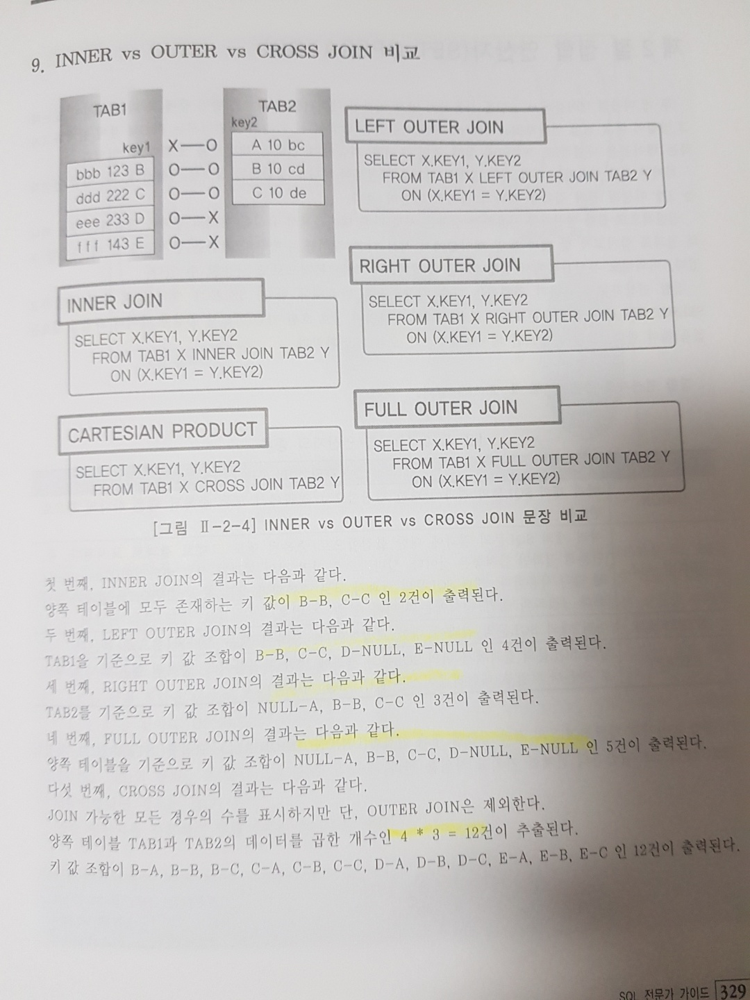

# [ 2장 ] SQL 활용

 - 본 문서의 SQL 예제의 벤더는 OracleDB를 기준으로 작성되었습니다.

## 1절 : 표준 조인(STANDARD JOIN)

### 1. STANDARD SQL 개요
 - 현재 사용하는 SQL의 많은 기능이 관계형 데이터베이스의 이론을 수립한 E.F.Codd 박사의 논문에 언급이 되어 있다. 논문에 언급된 8가지 관계형 대수는 각각 4개의 일반 집합 연산자와 순수 관계 연산자로 나눌 수 있으며, 관계형 데이터베이스 엔진 및 SQL의 기반 이론이 되었다.

 - 일반 집합 연산자를 현재의 SQL과 비교하면
1. UNION 연산은 UNION 기능으로,
2. INTERSECTION 연산은 INTERSECT 기능으로,
3. DIFFERENCE 연산은 EXCEPT(Oracle은 MINUS) 기능으로,
4. PRODUCT 연산은 CROSS JOIN 기능으로 구현되었다.

#### UNION 연산
 수학적 합집합을 제공하기 위해 공통 교집합의 중복을 없애기 위한 사전 작업으로 시스템에 부하를 주는 사전 정렬 작업이 발생한다. `UNION`은 정렬이 발생하지만 `UNION ALL`은 정렬이 발생하지 않아 둘의 출력 결과가 같다면 응답 속도 향상이나 자원 효율화 측면에서 데이터 정렬 작업이 발생하지 않은 UNION ALL을 사용하는 것을 권장한다.

 - 순수 관계 연산자를 현재의 SQL 문장과 비교하면
5. SELECT 연산은 WHERE 절로 구현되었다.
6. PROJECT 연산은 SELECT 절로 구현되었다.
7. (NATURAL) JOIN 연산은 다양한 JOIN 기능으로 구현되었다.
8. DIVIDE 연산은 현재 사용되지 않는다.

#### SELECT 연산과 SELECT 절은 다르다.
#### JOIN 연산
|WHERE절|INNER JOIN|
|:---:|:---|
|**FROM 절**|**NATRURAL JOIN, INNER JOIN, OUTER JOIN, USING 조건절, ON 조건절 등**|

 - 관계형 데이터베이스는 다음과 같은 절차를 거친다.
    - 1. 요구사항 분석
    - 2. 개념적 데이터 모델링
    - 3. 논리적 데이터 모델링
    - 4. 물리적 데이터 모델링

 - 정규화 과정의 경우 데이터 정합성과 데이터 저장 공간의 절약을 위해 엔터티를 최대한 분리하는 작업으로, 일반적으로 3차 정규형이나 보이스코드 정규형까지 진행하게 된다.

---

### 2. FROM 절 JOIN 형태

 - INNER JOIN은 WHERE 절부터 사용하던 JOIN의 DEFAULT 옵션으로 JOIN 조건에서 동일한 값이 있는 행만 반환한다.

 - NATURAL JOIN은 INNER JOIN의 하위 개념으로 NATRUAL JOIN은 두 테이블 간의 동일한 이름을 갖는 모든 칼럼들에 대해 EQUI(=) JOIN을 수행한다. NATURAL INNER JOIN이라고도 표시할 수 있으며, 결과는 NATURAL JOIN과 같다.

 - 과거 WHERE 절에서 JOIN 조건과 데이터 검증 조건이 같이 사용되어 용도가 불분명한 경우가 발생할 수 있었는데, WHERE 절의 JOIN 조건을 FROM 절의 ON 조건절로 분리하여 표시함으로써 사용자가 이해하기 쉽도록 한다.


---

### 3. INNER JOIN

INNER JOIN은 OUTER JOIN과 대비하여 내부 JOIN이라고 하며 JOIN 조건에서 동일한 값이 있는 행만 반환한다. INNER JOIN 표시는 그동안 WHERE 절에서 사용하던 JOIN 조건을 FROM 절에서 정의하겠다는 표시이므로 USING 조건절이나 ON 조건절을 필수적으로 사용해야 한다.

#### WHERE 절 JOIN 조건
```sql
SELECT emp.deptno, empno, ename, dname
FROM emp, dept
WHERE emp.deptno = dept.deptno;
```

#### FROM 절 JOIN 조건
```sql
SELECT emp.deptno, empno, ename, dname
FROM emp INNER JOIN dept 
ON emp.deptno = dept.deptno
```

#### INNER JOIN의 DEFAULT 옵션으로 아래 SQL문과 같이 생략 가능하다.
```sql
SELECT emp.deptno, empno, ename, dname
FROM emp JOIN dept
ON emp.deptno = dept.deptno;
```

---

### 4. NATURAL JOIN

NATURAL JOIN은 두 테이블 간의 **동일한 이름을 갖는 모든 칼럼에 대해** EQUI(=) JOIN을 수행한다. NATURAL JOIN이 명시되면, 추가로 USING 조건절, ON 조건절, WHERE 절에서 JOIN 조건을 정의할 수 없다. 

```sql
SELECT *
FROM emp NATURAL JOIN dept;
```
별도의 JOIN 칼럼을 지정하지 않았지만, 두 개의 테이블에서 deptno이라는 공통된 칼럼을 자동으로 인식하여 JOIN을 처리한 것이다. JOIN에 사용된 칼럼들은 같은 데이터 유형이어야 하며, ALIAS나 테이블명과 같은 접두사를 붙일 수 없다.
```sql
SELECT emp.deptno, empno, ename, dname
FROM emp NATURAL JOIN dept;

ERROR : NATURAL JOIN에 사용된 열은 식별자를 가질 수 없음
```

 - Inner은 컬럼이 따로, Natural은 합쳐지면서 맨 앞에 위치

---

### 5. USING 조건절
NATURAL JOIN에서는 모든 일치되는 칼럼들에 대해 JOIN이 이루어지지만, FROM 절의 USING 조건절을 이용하면 같은 이름을 가진 칼럼들 중에서 원한느 칼럼에 대해서만 선택적으로 EQUI JOIN을 할 수 있다. 

```sql
SELECT *
FROM emp JOIN dept
USING (deptno);
```
 - NATURAL JOIN과 마찬가지로 JOIN 칼럼에 대해서는 ALIAS나 테이블 이름과 같은 접두사를 붙일 수 없다.

 - Natural처럼 출력시 와일드카드(*)를 사용하면 공통된 칼럼이 맨앞에 위치하게 된다.

---

### 6. ON 조건절
JOIN 서술부(ON 조건절)와 비 JOIN 서술부(WHERE 조건절)를 분리하여 이해가 쉬우며, 칼럼명이 다르더라도 JOIN 조건을 사용할 수 있는 장점이 있다.

```sql
SELECT e.empno, e.ename, e.deptno, d.dname
FROM emp e JOIN dept d
ON (e.deptno = d.deptno)
```
 - 괄호는 옵션사항이다.
 - ON 조건절에 JOIN 조건 외에도 데이터 검색 조건을 추가할 수는 있으나 검색 조건 목적인 경우는 WHERE 절을 사용할 것을 권고한다.(다만, 아우터 조인에서 조인의 대상을 제한하기 위한 목적으로 사용되는 추가 조건의 경우는 ON 절에 표기되어야 한다.)

```sql
SELECT e.ename, e.mgr, d.deptno, d.dname
FROM emp e JOIN dept d
ON (e.deptno = d.deptno
    AND e.mgr = 7698);
```
or
```sql
SELECT e.ename, e.mgr, d.deptno, d.dname
FROM emp e JOIN dept d
ON (e.deptno = d.deptno)
WHERE e.mgr = 7698;
```

---

### 7. CROSS JOIN
E.F.CODD 박사가 언급한 일반 집합 연산자의 PRODUCT의 개념으로 JOIN 조건이 없는 경우 생길 수 있는 모든 데이터 조합을 말한다.
```sql
SELECT ename, dname
FROM emp CROSS JOIN dept
ORDER By ename;
```
 - NATURAL JOIN의 경우 WHERE 절에서 JOIN 조건을 추가할 수 없지만, CROSS JOIN의 경우 WHERE 절에 JOIN 조건을 추가할 수 있다. 그러나 INNER JOIN과 같은 결과를 얻기 때문에 구지 CROSS JOIN을 사용하기는....

---

### 8. OUTER JOIN
 - JOIN 조건에서 동일한 값이 없는 행도 반환할 때 사용할 수 있다. 즉, `tab1`과 `tab2`를 JOIN할 때 `tab2`의 JOIN 데이터가 없는 경우에도 `tab1`의 모든 데이터를 표시하고 싶을 수 있다.

 - 과거 OUTER JOIN을 위해 Oracle은 JOIN 칼럼 뒤에 '(+)'를 표시하였고, Sybase는 비교 연산자의 앞이나 뒤에 '(+)'를 표기했었는데, JOIN조건과 WHERE 절 검색 조건이 불명확한 단점, IN이나 OR 연산자 사용시 에러 발생. '(+)'표시가 누락된 칼럼 존재시 OUTER JOIN 오류 발생, FULL OUTER JOIN 미지원 등 불편함이 많았다.

 - OUTER JOIN 역시 JOIN 조건을 FROM 절에서 정의하겠다는 표시이므로 USING 조건절이나 ON 조건절을 필수적으로 사용해야 한다. 그리고 LEFT/RIGHT OUTER JOIN의 경우에는 기준이 되는 테이블이 조인 수행시 무조건 드라이빙 테이블이 된다. 

#### LEFT OUTER JOIN
 - JOIN 수행시 먼저 표기된 좌측 테이블에 해당하는 데이터를 먼저 읽은 후, 나중 표기도니 우측 테이블에서 JOIN 대상 데이터를 읽어 온다. 즉, A테이블, B테이블이 있을 때 A와 B를 비교했을 때 JOIN 칼럼에서 같은 값이 있을 때 그 해당 데이터를 가져오고 없으면 NULL로 채운다.

```sql
SELECT *
FROM emp LEFT OUTER JOIN dept
ON emp.deptno = dept.deptno;
```
 - OUTER 키워드 생략 가능

#### RIGHT OUTER JOIN
```sql
SELECT *
FROM emp RIGHT OUTER JOIN dept
ON emp.deptno = dept.deptno;
```
 - OUTER 키워드 생략 가능

#### FULL OUTER JOIN
 - LEFT OUTER JOIN과 RIGHT OUTER JOIN의 합집합. 단 UNION ALL이 아닌 UNION 기능과 같아서 중복되는 데이터 삭제
 - JOIN 수행시 좌측, 우측 테이블의 모든 데이터를 읽어 JOIN 하여 결과를 생성한다. 즉 A테이블, B테이블이 있을 때 둘다 기준이 된다는 것이다.

 ```sql
SELECT *
FROM employees e FULL OUTER JOIN departments d
ON e.department_id = d.department_id;
 ```

or

```sql
SELECT *
FROM employees e LEFT OUTER JOIN departments d
ON e.department_id = d.department_id;
UNION
SELECT *
FROM employees e RIGHT OUTER JOIN departments d
ON e.department_id = d.department_id;
```
 - OUTER 키워드 생략 가능

---

### 9. INNER vs OUTER vs CROSS JOIN 비교


---

## 2절 : 집합 연산자(SET OPERATOR)

 - 두 개 이상의 테이블에서 조인을 사용하지 않고 연관된 데이터를 조회하는 방법 중에서 또 따른 방버
 - 2개 이상의 질의 결과를 하나의 결과로 만들어 준다.
 - SELECT 절의 칼럼수가 동일하고, SELECT 절의 동일 위치에 존재하는 칼럼의 데이터 타입이 상호 호환 가능해야 한다. 여기서 반드시 동일한 데이터 타입일 필요는 없다.

#### 집합 연산자의 종류

| 집합 연산자 | 연산자의 의미 |
|:---:|:---|
|UNION|여려개의 SQL문의 결과에 대한 합집합으로 결과에서 모든 중복된 행은 하나의 행으로 만든다.|
|UNION ALL | 중복된 행도 그대로 결과로 표시된다. 합집합|
|INTERSECT | 여러 개의 SQL 문의 결과에 대한 교집합. 중복된 행은 하나의 행으로 만든다.|
|EXCEPT| 앞의 SQL문의 결과에서 뒤의 SQL문의 결과에 대한 차집합. 중복된 행은 하나의 행으로 만든다.|


---

## 3절 : 계층형 질의와 셀프조인

### 1. 계층형 질의

예를 들면 [사원 테이블]에서는 사원들 사이에 선임과 후임이 나뉘고 각 후임에겐 담당 선임이 배정되어 있을 것이다.

Oracle은 계층형 질의를 지원하기 위해 아래와 같이 제공
```sql
SELECT ...
FROM 테이블
WHERE 조건 AND 조건 ...
START WITH condition
CONNECT BY [NOCYCLE] 조건 AND 조건
[ORDER SIBLINGS BY 컬럼, 컬럼...]
```
 - START WITH 절은 계층 구조 전개의 시작 위치를 지정하는 구문이다. 루트 데이터를 지정한다.
 - CONNECT BY 절은 다음에 전개될 자식 데이터를 지정하는 구문이다. 자식 데이터는 CONNECT BY절에 주어진 조건을 만족해야 한다.
 - PRIOR : CONNECT BY 절에 사용되며, 현재 읽은 칼럼을 지정한다. PRIOR 자식 = 부모 형태를 사용하면 계층구조에서 부모 데이터에서 자식 데이터(부모-->자식) 방향으로 순방향으로 전개한다. PRIOR 부모 = 자식 형태라면 반대로 역방향 전개를 한다.
 - NOCYCLE : 데이터를 전개하면서 이미 나타났던 동일한 데이터가 전개중에 다시 나타난다면 이것을 CYCLE이 형성되었다고 하는데 이 떄는 RUNTIME 에러가 난다. NOCYCLE를 추가하면 사이클이 발생한 이후의 데이터는 전개하지 않는다.
 - ORDER SIBLINGS BY : 형제 노드(동일 LEVEL) 사이에 정렬을 수행한다.
 - WHERE : 모든 전개를 수행한 후에 지정 조건을 만족하는 데이터만 추출

#### 계층형 질의에서 사용되는 가상 칼럼
| 가상 칼럼 | 설명 |
|:---:|:---|
| LEVEL | 루트 데이터면 1, 그 하위 데이터면 2이다. 리프(Leaf)데이터까지 1씩 증가한다.|
| CONNECT_BY_ISLEAF | 전개 과정에서 해당 데이터가 리프 데이터면 1, 그렇지 않으면 0이다.|
| CONNECT_BY_ISCYCLE | 전개 과정에서 자식을 갖는데, 해당 데이터가 조상으로 존재하면 1, 그렇지 않으면 0이다. CYCLE 옵션을 사용했을 때만 사용할 수 있다.|
 - 순방향
```sql
SELECT LEVEL, LPAD(empno, 4 * (LEVEL), ' '), ename, job, mgr,
       CONNECT_BY_ISLEAF
FROM emp
START WITH mgr IS NULL
CONNECT BY PRIOR empno=mgr;
```
 - 역방향
```sql
SELECT LEVEL, LPAD(empno, 4 * (LEVEL), ' '), ename, job, mgr,
       CONNECT_BY_ISLEAF
FROM emp
START WITH mgr = 7788
CONNECT BY PRIOR mgr=empno;
```

### 2. 셀프 조인

셀프 조인(Self Join)이란 동일 테이블 사이의 조인을 말한다. 테이블과 칼럼 이름이 모두 동일하기 때문에 반드시 ALIAS를 사용해야 한다.

```sql
SELECT ALIAS1명.칼러명, ALIAS2명.칼럼명 ...
FROM 테이블 ALIAS1, 테이블 ALIAS2
WHERE ALIAS1.칼럼명 = ALIAS2.칼럼명;
```
 - 예시
```sql
SELECT manager.empno "매니저사번", manager.ename "매니저이름",
       worker.empno "그의 부하 사번", worker.ename "그의 부하 이름"
FROM emp worker, emp manager
WHERE worker.mgr = manager.empno;
```

---

## 4절 : 서브쿼리(Subquery)
서브쿼리(Subquery)란 하나의 SQL문안에 포함되어 있는 또다른 SQL문을 말한다.
 
서브쿼리는 메인쿼리의 칼럼을 사용할 수 있지만 메인쿼리는 서브쿼리의 칼럼을 사용할 수 없다.

#### 서브 쿼리가 SQL문에서 사용이 가능한 곳
 ✅ SELECT 절<br>
 ✅ FROM 절<br>
 ✅ WHERE 절<br>
 ✅ HAVING 절<br>
 ✅ ORDER BY 절<br>
 ✅ INSERT문의 VALUES 절 <br>
 ✅ UPDATE문의 SET 절<br>

#### 서브 쿼리의 종류
 - 동작하는 방식
    - `비연관 서브쿼리` : 서브쿼리가 메인쿼리의 칼럼을 가지고 있지 않은 형태으 ㅣ서브쿼리. 메인쿼리에 값(서브쿼리가 실행된 결과)을 제공하기 위한 목적으로 사용
    - `연관 서브쿼리`  : 서브쿼리가 메인쿼리 칼럼을 가지고 있는 형태의 서브쿼리이다. 일반적으로 메인쿼리가 먼저 수행되어 읽혀진 데이터를 서브쿼리에서 조건이 맞는지 확인하고자할 때 주로 사용된다.

 - 반환되는 데이터 형태
   - `Single Row 서브 쿼리` : 서브 쿼리 실행 결과가 1건 이하
   - `Multi Row 서브 쿼리` : 서브 쿼리 실행 결과가 여러 건인 서브쿼리
   - `Multi Column 서브 쿼리` : 서브쿼리 실행 결과가 여러 칼럼, 서브쿼리와 메인쿼리에서 비교하고자 하는 칼럼 개수와 칼럼의 위치가 동일해야 한다.

### 1. 단일 행 서브쿼리
 - `=`, `<`,`<=`, `>`, `>=`, `<>`
```sql
SELECT *
FROM emp
WHERE sal >=( SELECT AVG(sal)
              FROM emp );
```
### 2. 다중 행 서브쿼리
 - `IN`, `ALL`, `ANY`, `EXISTS`


`IN` : 서브쿼리의 결과에 존재하는 임의의 값과 동일한 조건(OR)<br>
`ALL` : 서브쿼리의 결과에 존재하는 모든 값을 만족하는 조건<br>
`ANY` : 서브 쿼리 결과에 존재하는 어느 하나의 값이라도 만족하는 조건<br>
`EXISTS` : 서브 쿼리 결과를 만족하는 값이 존재하는지 확인하는 조건을 의미, 조건을 만족하는 건이 여러 건이더라도 1건만 찾으면 더 이상 검색하지 않는다.
```sql
SELECT *
FROM emp
WHERE deptno IN ( SELECT deptno
                  FROM emp
                  GROUP BY deptno
                  HAVING AVG(sal)>=1000);
```

### 3. 다중 칼럼 서브쿼리
 - 서브쿼리의 결과로 여러 개의 칼럼이 반환되어 메인쿼리의 조건과 동시에 비교되는 것을 의미한다.
```sql
SELECT *
FROM emp
WHERE (ename, deptno) IN ( SELECT ename, deptno
                           FROM emp
                           WHERE ename LIKE 'S%');
```

### 4. 연관 서브쿼리
 - 연관 서브쿼리(Correlated Subquery)는 서브쿼리 내에 미인쿼리 칼럼이 사용된 서브쿼리이다.
 - `EXISTS` 서브쿼리는 항상 연관 서브쿼리로 사용된다.

### 5. 그밖의 위치에서 사용하는 서브쿼리

 - `SELECT` : 스칼라 서브쿼리(Scalar Subquery)
   - 스칼라 서브쿼리란 `한 행, 한 칼럼`만을 반환하는 서브쿼리를 말한다.
   - 2건 이상 반환하면 에러
 - `FROM` : 인라인 뷰(Inline View)
   - 마치 동적으로 생성된 테이블 처럼 사용 가능
   - 일반적인 뷰를 정적 뷰(Static View), 인라인 뷰를 동적 뷰(Dynamic View)라고도 한다.
   - 인라인 뷰에서는 ORDER BY절을 사용할 수 있다.
 - 그 외에도 `HAVING`, `UDATE문의 SET`, `INSERT문의 VALUES`에서 사용가능하다.

### 6. 뷰(View)
 - 테이블은 실제 데이터를 가지고 있는 반면 뷰는 실제 데이터를 가지고 있지 않다. 뷰는 단지 뷰 정의(View Definition)만을 가지고 있다.
 - 질의에서 뷰가 사용돠ㅣ면 뷰 정의를 참조해서 DBMS 내부적으로 질의를 재작성(Rewirte)하여 질의를 수행한다.
 - 뷰는 실제 데이터를 가지고 있지 않지만 테이블이 수행하는 역할을 수행하기 때문에 가상 테이블(Virtual Table)이라고도 한다.

#### 뷰의 장점
 - `독립성` : 테이블 구조가 변경되어도 뷰를 사용하는 응용 프로그램은 변경하지 않아도 된다.
 - `편리성` : 복잡한 질의를 뷰로 생성하믕로써 관련 질의를 단순하게 작성할 수 있다. 또한 해당 형태의 SQL문을 자주 사용할 때 뷰를 이용하면 편리하게 사용할 수 있다.
 - `보안성` : 직원 급여정보와 같이 숨기고 싶은 정보가 존재한다면, 뷰를 생성할 때 해당 칼럼을 빼고 생성함으로써 사용자에게 정보를 감출 수 있다.

뷰는 다음과 같이 `CREATE VIEW`문을 통해서 생성 가능하다.
```sql
CREATE VIEW V_PLAYER_TEAM AS
SELECT P.PLAYER_NAME, P.POSITION, P.BACK_NO, P.TEAM_ID, T.TEAM_NAME
FROM PLAYER P, TEAM T
WHERE P.TEAM_ID = T.TEAM_ID;
```
뷰틑 테이블뿐만아니라 이미 존재하는 뷰를 참조해서도 생성할 수 있다.
```sql
CREATE VIEW V_PLAYER_TEAM_FILTER AS
SELECT PLAYER_NAME, POSTION, BACK_NO, TEAM_NAME
FROM V_PLAYER_TEAM
WHERE POSTION IN ('GK', 'MF');
```
뷰를 제거하기 위해서는 아래 `DROP VIEW`문을 이용한다.
```sql
DROP VIEW V_PLAYER_TEAM;
DROP VIEW V_PLAYER_TEAM_FILTER;
```

---

## 5절 : 그룹함수(GROUP FUNCTION)

ANSI/ISO SQL 표준은 데이터분석을 위해서 다음 세가지 함수를 정의하고 있다.
<br><br><br>

 -  AGGREGATE FUNCTION

GROUP AGGREGATE FUNCTION이라고도 부르며, GROUP FUNCTION의 한 부분으로 분류할 수 있다.

`COUNT`, `SUM`, `AVG`, `MAX`, `MIN`
<br><br><br>

 - GROUP FUNCTION

`ROLLUP은` GROUP BY의 확장된 형태로 사용하기가 쉬우며 병렬로 수행이 가능하기 때문에 매우 효과적일 뿐 아니라 시간 및 지역처럼 계층적 불류를 포함하고 있는 데이터의 집계에 적합하도록 되어 있음

`CUBE는` 결합 가능한 모든 값에 대하여 다차원적인 집게를 생성하게 되므로 ROLLUP에 비해 다양한 데이터를 얻는 장점이 있는 반면에, 시스템에 부하를 많이 주는 단점이 있다.

`GROUPING` SETS는 원하는 부분의 소계만 손쉽게 추출할 수 있는 장점이 있다.

`ROLLUP, CUBE, GROUPING SETS` 결과에 대한 정렬이 필요한 경우는 ORDER BY 절에 정렬 칼럼을 명시하여야 한다.
<br><br><br>

 -  WINDOW FUNCTION

분석 함수(ANALYTIC FUNCTION)나 순위 함수(RANK FUNCTION)로도 알려져 있는 윈도우 함수는 데이터 웨어하우스에서 발전한 기능

### ROLLUP 함수
#### 일반적인 GROUP BY 절 이용
```sql
SELECT dname, job, COUNT(*), SUM(sal)
FROM emp, dept
WHERE dept.deptno = emp.deptno
GROUP BY dname, job;
```

#### GROUP BY + ORDER BY 절 사용
```sql
SELECT dname, job, COUNT(*), SUM(sal)
FROM emp, dept
WHERE dept.deptno = emp.deptno
GROUP BY dname, job
ORDER BY dname, job;
```

#### ROLLUP 함수 사용
subtotal이 생기게 된다.
```sql
SELECT dname, job, COUNT(*), SUM(sal)
FROM emp, dept
WHERE dept.deptno = emp.deptno
GROUP BY ROLLUP (dname, job)
ORDER BY dname, job;
```

#### GROUPING함수 사용
ROLLUP이나 CUBE에 의한 소계가 계산된 결과 컬럼(subtotal인 컬럼)에는 1이 표시됨. 이것을 이용해 문자열을 지정할 수 있음.
```sql
SELECT dname, GROUPING(dname), job, GROUPING(job), COUNT(*), SUM(sal)
FROM emp, dept
WHERE dept.deptno = emp.deptno
GROUP BY ROLLUP (dname, job)
ORDER BY dname, job;
```
GROUPING 결과에 따른 문자열 컨트롤하기
```sql
SELECT CASE GROUPING(dname) WHEN 1 THEN 'All department' ELSE dname END AS depatment_name, 
       CASE GROUPING(job) WHEN 1 THEN 'All job' ELSE job END AS job_name, 
       COUNT(*) "total employee", 
       SUM(sal) "total sales"
FROM emp, dept
WHERE dept.deptno = emp.deptno
GROUP BY ROLLUP (dname, job)
ORDER BY dname, job;
```
### CUBE 함수
ROLLUP은 단지 가능한 subtotal들만 생성했지만 CUBE는 결합 가능한 모든 값에 대하여 다차원 집계를 생성한다.

내부적으로 Grouping Columns의 순서를 바꾸어서 또 한번의 Query를 수행해야하고 Grand Total은 양쪽의 Query에서 모두 생성이 되므로 한번의 Query에서는 제거되어야만 하므로 ROLLUP에 비해 시스템 연산 대상이 많다.
```sql
SELECT CASE GROUPING(dname) WHEN 1 THEN 'All department' ELSE dname END AS depatment_name, 
       CASE GROUPING(job) WHEN 1 THEN 'All job' ELSE job END AS job_name, 
       COUNT(*) "total employee", 
       SUM(sal) "total sales"
FROM emp, dept
WHERE dept.deptno = emp.deptno
GROUP BY CUBE (dname, job)
ORDER BY dname, job;
```

#### 왜 사용 하는가
ex) CUBE 함수가 없다면?
```sql
SELECT dname, job, COUNT(*) "total employee", SUM(sal) "total sales"
FROM emp, dept
WHERE dept.deptno = emp.deptno
GROUP BY dname, job
UNION ALL
SELECT dname, 'all job', COUNT(*) "total employee", SUM(sal) "total sales"
FROM emp, dept
WHERE dept.deptno = emp.deptno
GROUP BY dname
UNION ALL
SELECT 'all department', job, COUNT(*) "total employee", SUM(sal) "total sales"
FROM emp, dept
WHERE dept.deptno = emp.deptno
GROUP BY job
UNION ALL
SELECT 'all department', 'all job', COUNT(*) "total employee", SUM(sal) "total sales"
FROM emp, dept
WHERE dept.deptno = emp.deptno;
```

### GROUPING SETS 함수
GROUPING SETS는 ROLLUP과 달리 인수의 순서가 바뀌어도 서로 평등한 관계이므로 결과가 같다.

일반적인 함수를 사용한 sql
 - 부서별, job별 인원수와 급여 합을 구하라
```sql
SELECT dname, 'all job', COUNT(*) "total employee", SUM(sal) "total sales"
FROM emp, dept
WHERE dept.deptno = emp.deptno
GROUP BY dname
UNION ALL
SELECT 'all department', job, COUNT(*) "total employee", SUM(sal) "total sales"
FROM emp, dept
WHERE dept.deptno = emp.deptno
GROUP BY job
```
GROUPING SETS 사용
```sql
SELECT CASE GROUPING(dname) WHEN 1 THEN 'All department' ELSE dname END AS depatment_name, 
       CASE GROUPING(job) WHEN 1 THEN 'All job' ELSE job END AS job_name, 
       COUNT(*) "total employee", 
       SUM(sal) "total sales"
FROM emp, dept
WHERE dept.deptno = emp.deptno
GROUP BY GROUPING SETS (dname, job)
ORDER BY dname, job;
```
 - 부서-job-매니저 별 집계 + 부서-job별 집계, job-매니저별 집계를 GROUPING SETS 함수를 이용해서 구해보기
```sql
SELECT CASE GROUPING(dname) WHEN 1 THEN 'All department' ELSE dname END AS depatment_name, 
       CASE GROUPING(job) WHEN 1 THEN 'All job' ELSE job END AS job_name, 
       COUNT(*) "total employee", 
       SUM(sal) "total sales"
FROM emp, dept
WHERE dept.deptno = emp.deptno
GROUP BY GROUPING SETS ((dname, job, mgr),(dname, job),(job,mgr));
```
괄호로 묶은 집합을 볼 수 있는데, 이는 계층구조가 아닌 하나의 데이터로 간주한다.


---

## 6절 : 윈도우 함수(WINDOW FUNCTION)
### 1. 개요
기존 RDB는 칼럼과 칼럼간의 연산, 비교, 연결이나 집합에 대한 집계는 쉬우나, 행과 행간의 관계를 SQL문으로 처리하는 것이 매우 어려웠다. `PL/SQL`, `T-SQL`, `PRO*C`같은 절차형 프로그램을 작성하거나 INLINE VIEW를 이용해 복잡한 SQL문을 작성해야 하던 것을 부분적으로 행과 행간의 관계를 쉽게 정의하기 위해 만든 함수가 WINDOW 함수이다.

윈도우 함수는 분석 함수나 순위 함수로 알려져 있다.

윈도우 함수는 다른 함수와 달리 중첩(NEST)해서 사용할 수는 없지만 서브쿼리에서는 사용할 수 있다.

#### 종류
 1. 그룹 내 순위(RANK) 관련 함수 : `RANK`, `DENSE_RANK`, `ROW_NUMBER`
 2. 그룹 내 집계(AGGREGATE) 관련 함수 : `SUM`,`MAX`, `MIN`, `AVG`, `COUNT`
 3. 그룹 내 행 순서 관련 함수 : `FIRST_VALUE`, `LAST_VALUE`, `LAG`, `LEAD`
 4. 그룹 내 비율 관련 함수 : `CUME_DIST`, `PERCENT_RANK`, `NTILE`, `RATIO_TO_REPORT`

#### WINDOW FUNCTION SYNTAX
 - WINDOW 함수에는 OVER 문구가 키워드로 필수 포함된다.
```sql
SELECT window_function (arguments) OVER
([PARTITION BY 칼럼] [ORDER BY 절] [WINDOWING 절])
FROM 테이블 명;
```

#??? WINDOWING 절 사용법을 모르겠다.

### 2. 그룹 내 순위 함수

#### RANK 함수
RANK 함수는 ORDER BY를 포함한 QUERY문에서 특정 항목(칼럼)에 대한 순위를 구하는 ㅎ마수이다. 이때 특정 범위(PARTITION) 내에서 순위를 구할 수도 있고 전체 데이터에 대한 순위를 구할 수도 있다. 또 동일한 값에 대해서는 동일한 순위를 부여하게 된다.
```sql
SELECT job, ename, sal,
       RANK() OVER(ORDER BY sal DESC) ALL_RANK,
       RANK() OVER(PARTITION BY job ORDER BY sal DESC) JOB_RANK
FROM emp;
```

#### DENSE_RANK 함수
RANK와 흡사하나 동일한 순위를 하나의 건수로 취급하는 것이 틀린점이다.
```sql
SELECT job, ename, sal,
       RANK() OVER(ORDER BY sal DESC) RANK,
       DENSE_RANK() OVER(ORDER BY sal DESC) DENSE_RANK
FROM emp;
```

#### ROW_NUMBER 함수
동일한 값이라도 고유한 순위를 부여한다.
```sql
SELECT job, ename, sal,
       RANK() OVER(ORDER BY sal DESC) RANK,
       ROW_NUMBER() OVER(ORDER BY sal DESC) ROW_NUMBER
FROM emp;
```

### 3. 일반 집계 함수
#### SUM 함수
 - 사원들의 급여와 같은 매니저를 두고 있는 사원들의 salary합을 구한다.
```sql
SELECT mgr, ename, sal, SUM(sal) OVER (PARTITION BY mgr) mgr_sum
FROM emp;
```

  - OVER절 내에 ORDER BY 절을 추가해 파티션 내 데이터를 정렬하고 이전 salary데이터까지의 누적값을 출력한다.(SQL Server는 ORDER BY 절을 지원하지 않는다.)
```sql
SELECT mgr, ename, sal,
       SUM(sal) OVER (PARTITION BY mgr ORDER BY sal RANGE UNBOUNDED PRECEDING)
FROM emp;

RANGE UNBOUNDED PRECEDING :
현재 행을 기준으로 파티션 내의 첫 번째 행까지의 범위를 지정한다.
```

#### MAX 함수
 - 사원들의 급여와 같은 매니저를 두고있는 사원들의 SALARY 중 최대값을 같이 구한다.
```sql
SELECT mgr, ename, sal, MAX(sal) OVER (PARTITION BY mgr) AS MGR_MAX
FROM emp;
```

#### MIN 함수
 - 사원들의 급여와 같은 매니저를 두고 있는 사원들을 입사일자를 기준으로 정렬하고 SALARY 최소값을 같이 구한다.
```sql
SELECT mgr, ename, hiredate, sal,
       MIN(sal) OVER(PARTITION BY mgr ORDER BY hiredate) AS MGR_MIN
FROM emp;
```

#### AVG 함수
 - EMP 테이블에서 같은 메니저를 두고 있는 사원들의 평균 SALARY를 구하는데, 조건은 같은 매니저 내에서 자기 바로 앞의 사번과 바로 뒤의 사번인 직원만을 대상으로 한다.
```sql
SELECT mgr, ename, hiredate, sal,
       ROUND(AVG(SAL) OVER(PARTITION BY mgr BY hiredate
             ROWS BETWEEN 1 PRECEDING AND 1 FOLLOWING)) AS MGR_AVG
FROM emp;

ROWS BETWEEN 1 PRECEDING AND 1 FOLLOWING:
현재 행을 기준으로 파티션 내에서 한 건, 현재 행, 뒤의 한 건을 범위로 지정한다.
(ROWS는 현재 행의 앞뒤 건수를 말하는 것임)
```

#### COUNT 함수
 - 사원들을 급여 기준으로 정렬하고, 본인의 급여보다 50이하가 적거나 150이하로 많은 급여를 받는 인원수를 출력하라.
```sql
SELECT ename, sal,
       COUNT(*) OVER (ORDER BY sal
       RANGE BETWEEN 50 PRECEDING AND 150 FOLLOWING) AS SIM_CNT
FROM emp;
```

### 4. 그룹 내 행 순서 함수
#### FIRST_VALUE 함수
 - 부서별 직원들을 연봉이 높은 순서부터 정렬하고, 파티션 내에서 가장 먼저 나온 값을 출력한다.
```sql
SELECT deptno, ename, sal,
       FIRST_VALUE(ename) OVER (PARTITION BY deptno ORDER BY sal DESC
       ROWS UNBOUNDED PRECEDING) AS DEPT_RICH
FROM emp;

ROWS UNBOUNDED PRECEDING
현재 행을 기준으로 파티션 내의 첫번째 행까지 범위를 지정한다.
```

#### LAST_VALUE 함수
 - 부서별 직원들을 연봉이 높은 순서부터 정렬하고, 파티션 내에서 가장 마지막에 나온 값을 출력한다.
```sql
SELECT deptno, ename, sal,
       LAST_VALUE(ename) OVER
       (PARTITION BY deptno ORDER BY sal DESC
        ROWS BETWEEN CURRENT ROW AND UNBOUNDED FOLLOWING) AS DEPT_POOR
FROM emp;

ROWS BETWEEN CURRENT ROW AND UNBOUNDED FOLLOWING;
현재 행을 포함해서 파티션 내의 마지막 행까지 범위를 지정한다.
```

#### LAG 함수
이 함수를 통해 파티션별 윈도우에서 이전 몇 번째 행의 값을 가져올 수 있다.
 - 직원들을 입사일자가 빠른 기준을 정렬을하고 본인보다 입사일자가 한명 앞선 사원의 급여를 본인의 급여와 함께 출력한다.
```sql
SELECT ename, hiredate, sal, LAG(sal) OVER (ORDER BY hiredate) AS PREV_SAL
FROM emp
WHERE job = 'SALESMAN';
```
 - NULL을 다른 값으로
```sql
SELECT ename, hiredate, sal, 
       LAG(sal, 2, 0) OVER (ORDER BY hiredate) AS PREV_SAL
FROM emp
WHERE job = 'SALESMAN';
```

####  LEAD 함수
파티션별 윈도우에서 이후 몇 번째 행의 값을 가져올 수 있다.
```sql
SELECT ename, hiredate,
       LEAD(hiredate, 1) OVER (ORDER BY hiredate) AS "NEXTHIRED"
FROM emp;
```

### 5. 구룹 내 비율 함수
#### RATIO_TO_REPORT 함수
이 함수를 이용해 파티션 내 전체 SUM(칼럼)값에 대한 행별 칼럼값의 백분율을 소수점으로 구할 수 있다. 결과 값은 > 0 & <= 1의 범위를 가진다. 그리고 개별 RATIO의 합을 구하면 1이 된다.
 - JOB이 SALESMAN인 사원들을 대상으로 전체 급여에서 본인이 차지하는 비율을 출력한다.
```sql
SELECT ename, sal, ROUND(RATIO_TO_REPORT(sal) OVER (), 2) AS R_R
FROM emp
WHERE job = 'SALESMAN';
```

#### PERCENT_RANK 함수
파티션별 우디ㅗ우에서 제일 먼저 나오는 것을 0으로, 제일 늦게 나오는 것을 1로하여, 값이 아닌 행의 순서별 백분율을 구한다. 결과 값은 >= 0 & <= 1의 범위를 가진다.
 - 같은 부서 소속 사원들의 집합에서 본인의 급여가 순서상 몇번째 위치쯤에 있는지 0과 1사이의 값으로 출력한다.
```sql
SELECT deptno, ename, sal,
       PERCNET_RANK() OVER (PARTITION BY deptno ORDER BY sal DESC) AS P_R
FROM emp;
```

#### CUME_DIST 함수
파티션별 위도우의 전체 건수에서 현재 행보다 작거나 같은 건수에 대한 누적백분율을 구한다. 결과 값은 > 0 & <= 1의 범위를 가진다.
 - 같은 부서 소속 사원들의 집합에서 본인의 급여가 누적 순서상 몇 번째 위치쯤에 있는지 0과 1사이의 값으로 출력한다.
```sql
SELECT deptno, ename, sal,
       CUME_DIST() OVER (PARTITION BY deptno ORDER BY sal DESC) AS CUME_DIST
FROM emp;
```

#### NTILE 함수
파티션별 전체 건수를 ARGUMENT 값으로 N 등분한 결과를 구할 수 있다.
 - 전체 사원을 급여가 높은 순서로 정렬하고, 급여를 기준으로 4개의 그룹을 분류한다.
```sql
SELECT ename, sal, NTILE(4) OVER(ORDER BY sal DESC) AS QUAR_TILE
FROM emp;
```

---

## 7절 : DCL(DATA CONTROL LANGUAGE)
### 1. DCL 개요
유저를 생성하고 권한을 제어할 수 있는 명령어

### 2. 유저와 권한
#### 유저 생성과 시스템 권한 부여
유저를 생성하고 데이터베이스에 접속한다고해서 `테이블`, `뷰`,`인덱스`등과 같은 오브젝트(OBJECT)를 생성할 수 없다. 사용자가 실행하는 모든 DDL문장(CREATE, ALTER, DROP, RENAME 등)은 그에 해당하는 적절한 권한이 있어야만 문장을 실행할 수 있다.

이러한 권한을 시스템 권한이라고 하며 약 100개 이상의 종류가 있다. 100개 이상의 시스템 권한을 일일이 사용자에게 설정하는 것은 너무 복잡하고, 특히 유저로부터 권한을 관리하기가 어렵다.

그래서 ROLE을 이용하여 간편하고 쉽게 권한을 부여하게 된다. 
```sql
CONN SCOTT/TIGER

CREATE USER PJS IDENTIFIED BY KOREA7;

1행에 오류:
ERROR: 권한이 불충분하다.
```
이때는 유저생성 권한(CREATE USER)을 부여하면 된다.
```sql
GRANT CREATE USER TO SCOTT;
권한이 부여 되었다.
```
PJS 유저가 생성됐지만 아무런 권한도 부여받지 못하여 CREATE SESSION 권한이 없다는 오류가 발생한다.

이때는 로그인을 할 수 있도록 CREATE SESSION 권한을 부여한다.
```sql
GRANT CREATE SESSION TO PJS;
```
PJS 유저는 테이블 생성 권한이 없다. 그러므로 CREATE TABLE 권한을 부여한다.
```sql
GRANT CREATE TABLE TO PJS;
```
이처럼 많은 권한이 있다.
```sql
-- SCOTT에게 MENU 테이블에 대한 SELECT 권한을 준다.
GRANT SELECT ON MENU TO SCOTT;
```

### 3. ROLE을 이용한 권한 부여
앞서 본 것 처럼 기본적으로 CREATE SESSION, CREATE TABLE, CREATE PROCEDURE 등 많은 권한을 부여해야 한다.

데이터베이스 관리자는 ROLE을 생성하고, ROLE에게 각종 권한들을 부여한 후 ROLE을 다른 ROLE이나 유저에게 부여할 수 있다. 이처럼 해당 ROLE만을 부여함으로써 빠르고 정확하게 필요한 권한을 부여할 수 있게 된다.

 - PJS 유저에게 CREATE SESSION과 CREATE TABLE  권한을 가진 ROLE을 생성한 후 ROLE을 이용하여 다시 권한을 할당한다. 권한을 취소할 때는 `REVOKE`를 사용한다.

```sql
CONN SYSTEM/MANAGER;

REVOKE CREATE SESSION, CREATE TABLE FROM PJS;

CONN PJS/KOREA7;
ERROR : 사용자는 CREATE SESSION권한을 가지고 있지않음. 로그인이 거절되었다.
```

```sql
CREATE ROLE LOGIN_TABLE;
롤이 생성되었다.

GRANT CREATE SESSION, CREATE TABLE TO LOGIN_TABLE;
권한이 부여되었다.

GRANT LOGIN_TABLE TO PJS;
권한이 부여되었다.

CONN PJS/KOREA7
연결되었다.

CREATE TABLE menu2(
  menu_seq NUBMER NOT NULL,
  title VARCHAR2(10)
);
테이블이 생성되었다.
```
Oracle은 기본적으로 몇가지 ROLE을 제공하고 있다.
 - `CONNECT`
 - `RESOURCE`

유저를 삭제하는 명령어는 DROP USER이고, CASCADE옵션을 주면 해당 유저가 생성한 오브젝트를 먼저 삭제한 후 유저를 삭제한다.
```sql
DROP USER PJS CASCADE;
```

## 8절 : 절차형 SQL

### 1. 절차형 SQL 개요
일반적인 개발 언어처럼 SQL에도 절차 지향적인 프로그램이 가능하도록 DBMS 벤더별로 PL(Procedural Langauge)/SQL(Oracle), SQL/PL(DB2), T-SQL(SQL Server) 등 절차형 SQL을 제공하고 있다.

절차형 SQL을 이용하면 SQL문의 연속적인 실행이나 조건에 따른 분기처리를 이용하여 특정 기능을 수행하는 저장 모듈을 생성할 수 있다. 상세한 내역은 각 DBMS 벤더의 메뉴얼을 참조한다.

 - PROCEDURE
 - TRIGGER
 - USER DEFINED FUNCTION

[Oracle PL/SQL 메뉴얼](https://docs.oracle.com/database/121/LNPLS/toc.htm)