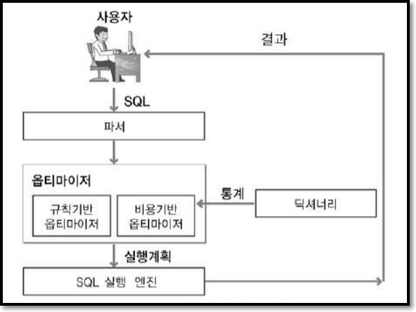
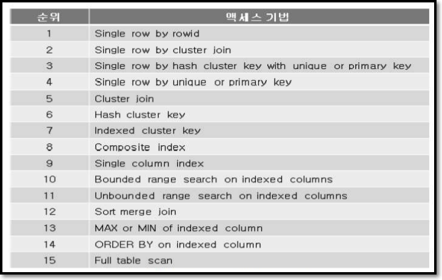
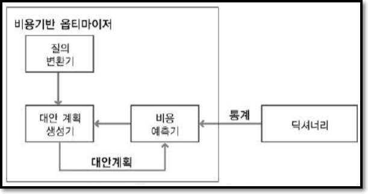
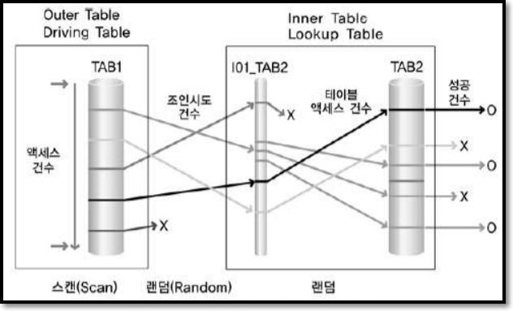
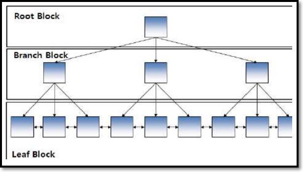
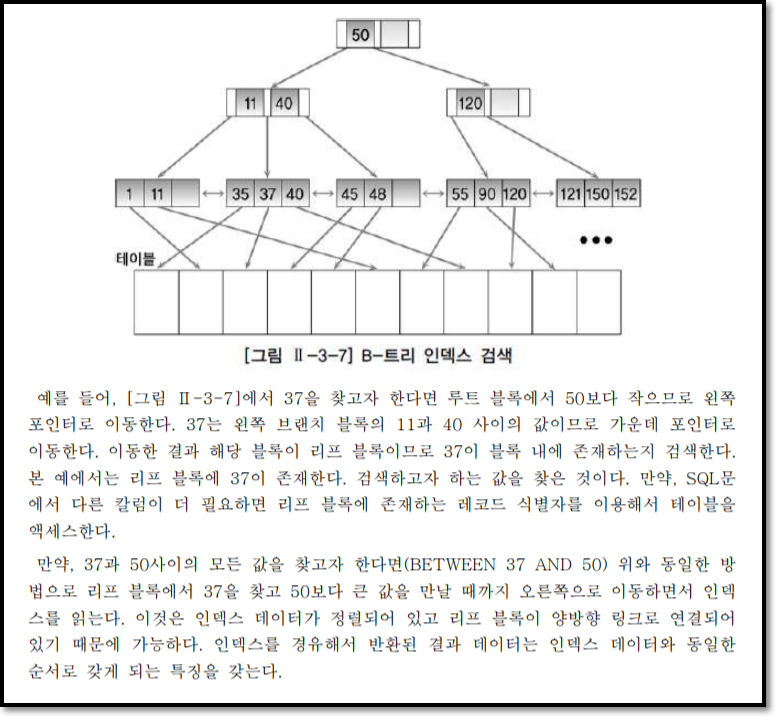
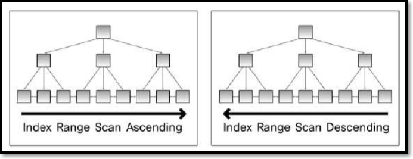

# [ 3장 ] SQL 최적화 기본 원리

## 1절 : 옵티마이저와 실행계획

### 1. 옵티마이저
`옵티마이저(Optimizer)`는 사용자가 질의한 SQL문에 대해 최적의 실행 방법을 결정하는 역할을 수행한다. 이러한 최적의 실행방법을 `실행 계획(Execution Plan)`이라고 한다. 옵티마이저가 최적의 실행 방법을 결정하는 방식에 따라
 - 규칙기반 옵티마이저(RBO, Rule Optimizer)
 - 비용기반 옵티마이저(CBO, Cost Based Optimizer)
 
 로 구분한다.



현재 대부분의 관계형 데이터베이스는 비용기반 옵티마이저만을 제공한다 비록 규칙기반 옵티마이저를 제공하더라도 신규 기능들에 대해서는 더 이상 지원하지 않는다. 다만 하위 버전 호환성을 위해서만 규칙기반 옵티마이저가 남아 있을 뿐이다.그렇지만 규칙기반 옵티마이저의 규칙은 보편 타당성에 근거한 것들이다. 이러한 규칙을 알고 있는 것은 옵티마이저의 최적화 작업을 이해하는데 도움이 된다.

#### 가. 규칙기반 옵티마이저
규칙기반 옵티마이저는 규칙(우선 순위)을 가지고 실행계획을 생성한다.

Oracle의 규칙기반 옵티마이저의 15가지 규칙이다. 순위의 숫자가 낮을수록 높은 우선 순위다.



####  나. 비용기반 옵티마이저
규칙기반 옵티마이저는 조건절에서 `=`연산자와 `BETWEEN`연산자가 사용되면 규칙에 따라 `=`칼럼의 인덱스를 사용하는 것이 보다 적은 일량, 보다 적은 처리 범위로 작업을 할 것이라고 판단한다. 그러나 실제로는 `BETWEEN` 칼럼을 사용한 인덱스가 보다 일량이 적다. 이러한 한계 때문에 등장했다.

비용기반 옵티마이저는 SQL문을 처리하는데 필요한 비용이 가장 적은 실행계획을 선택하는 방식이다.


 - 질의 변환기 : 사용자가 작성한 SQL문을 처리하기에 보다 용이한 형태로 변환하는 모듈

  - 대안 계획 생성기 : 동일한 결과를 생성하는 다양한 대안 계획을 생성하는 모듈. 현실적으로 최적의 대안이 포함되지 않을 수도 있다. 왜냐 하면 대안 계획이 많아지면 그만큼 최적화 수행시간이 오래걸리기 때문이다. 그러므로 대안 계획의 수를 제약하는 다양한 방법을 사용한다.
    - 연산 적용 순서 변경
    - 연산 방법 변경
    - 조인 순서 변경
 - 비용 예측기 : 대안 계획의 비용 예측 모듈. 정확한 비용을 예측을 위해 정확한 통계정볼르 필요로 한다.

### 2. 실행계획
실행계획(Execution Plan)이란 SQL에서 요구한 사항을 처리하기 위한 절차와 방법을 의미한다. 

실행 게획을 생성한다는 것은 SQL을 어떤 순서로 어떻게 실행할지를 결정하는 작업이다.

옵티마이저는 다양한 처리방법들 중에서 가장 효율적인 방법을 찾아준다. 

옵티마이저 = SQL 프로그램의 진정한 프로그래머(?)

Oracle의 실행계획 형태
 - 조인 순서(Join Order)
 - 조인 기법(Join Method)
 - 엑세스 기법(Access Method)
 - 최적화 정보(Optimization Information)
 - 연산(Operation)

`조인 순서` : 조인작업 수행할 때 참조하는 테이블의 순서

`조인 기법` : NL join || Hash Join || Sort Merge Join

`엑세스 기법` : 테이블 엑세스 기법. 인덱스를 이용하여 스캔하는 인덱스 스캔(Index Scan), 테이블 전체를 모두 읽으면서 조건을 만족하느 행을 찾는 전체 테이블 스캔(Full Table Sacn) 등이 있다.

`최적화 정보`는 옵티마이저가 실행계획의 각 단계마다 예상되는 비용 사항을 표시한 것이다. 최적화 정보에는 **Cost**, **Card**, **Bytes**가 있다 
 - Cost는 상대적인 비용 정보이고 
 - Card는 Cardinality의 약자로서 주어진 조건을 만족한 결과 집합 혹은 조인 조건 을 만족한 결과 집합의 건수를 의미한다 
 - Bytes는 결과 집합이 차지하는 메모리 양을 바이트로 표시한 것이다. 
 - 연산은 여러 가지 조작을 통해서 원하는 결과를 얻어내는 일련의 작업이다

### 3. SQL 처리 흐름도
SQL 처리 흐름도(Access Flow Diagram)란 SQL의 내부적인 처리 절차를 시각적으로 표현한 도표이다.


<hr>

## 2절 : 인덱스 기본
### 1. 인덱스 특징과 종류
인덱스는 원하는 데이터를 쉽게 찾을 수 있도록 돕는 책의 찾아보기와 유사한 개념이다. 테이블에 인덱스를 생성하지 않아도 되고 여러 개를 생성해도 된다. 인덱스의 기본 목적은 검색 성능의 최적화이다. 즉, Insert, Update, Delete와 같은 DML 작업은 테이블과 인덱스를 함께 변경해야 하기 때문에 오히려 느려질 수 있다.

#### 가. 트리 기반 인덱스
DBMS에서 가장 일반적인 인덱스는 B-트리 인덱스이다.


B-트리 인덱스는 `=`로 검색하는 일치(Exact Match) 검색과 범위(Range) 검색 모두에 적합한 구조이다.




이 외에도 
 - 비트맵 인덱스(Bitmap Index)
 - 리버스 키 인덱스(Reverse Key Index)
 - 함수기반 인덱스(FBI, Function-Based Index)

등이 존재한다.

#### 나. SQL Server의 클러스터형 인덱스
SQL Server의 인덱스 종류는 저장 구조에 따라 클러스터형(clustered) 인덱스와 비클러스터형(nonclustered) 인덱스로 나뉜다. 

### 2. 전체 테이블 스캔과 인덱스 스캔
#### 가. 전체 테이블 스캔
전체 테이블 스캔 방식으로 데이터를 검색한다는 것은 테이블에 존재하는 모든 데이터를 읽어가면서 조건에 맞으면 결과로서 추출하고 조건에 맞지 않으면 버리는 방식으로 검색한다.

전체 테이블 스캔 방식은 테이블에 존재하는 모든 블록의 데이터를 읽는다. 옵티마이저가 연산으로서 전체 테이블 스캔 방식을 선택하는 이유는 다음과 같다.

 - SQL문에 조건이 존재하지 않은 경우
 - SQL문의 주어진 조건에 사용 가능한 인덱스가 존재하지 않은 경우
 - 옵티마이저 취사 선택
    - 조건을 만족하는 데이터가 많은 경우, 결과를 추출하기 위해서 테이블의 대부분의 블록을 덱세스해야한다고 옵티마이저가 판단하면 조건에 사용 가능한 인덱스가 존재해도 전체 테이블 스캔 방식으로 읽을 수 있다.
 - 그 밖의 경우
   - 병렬처리 방식으로 처리하는 경우
   - 전체 테이블 스캔 방식의 힌트를 사용한 경우

#### 나. 인덱스 스캔
인덱스 스캔은 인덱스를 구성하는 칼럼의 값을 기반으로 데이터를 추출하는 엑세스 기법이다. 제공되는 인덱스 스캔 방식은 데이터베이스 벤더마다 다를 수 있다.

주로 사용되는 것 : 트리 기반 인덱스
 - 인덱스 유일 스캔(Index Unique Scan)
 - 인덱스 범위 스캔(Index Range Scan)
 - 인덱스 역순 범위 스캔(Index Range Scan Descending)



<hr>

## 3절 : 조인 수행 원리
FROM 절에 A, B, C라는 3개의 테이블이 존재하더라도 3개의 테이블이 동시에 조인이 수행되는 것은 아니다. 먼저 2개의 테이블에 대해 조인이 수행 된다. 그리고 먼저 수행된 조인 결과와 나머지 테이블 사이에서 조인이 수행된다. 

이 때, 조인 단계별로 다른 조인 기법을 사용할 수 있다. 예를 들어, A와 B테이블을 조인할 때는 NL Join기법을 사용하고 C테이블을 조인할 때는 Hash Join 기법을 사용할 수 있다.

조인 기법은 2개의 테이블을 조인할 때 사용할 수 있는 방법이다.

자주 사용하는 조인 기법은 `NL join`, `Hash join`, `Sort Merge join`

### 1. NL Join
NL Join은 프로그래밍에서 사용하는 중첩된 반복문과 유사한 방식으로 조인을 수행한다. 반복문의 외부에 있는 테이블을 선행 테이블 또는 외부 테이블(Outer Table)이라고 하고, 반복문의 내부에 있는 테이블을 후행 테이블 또는 내부 테이블(Inner Table)이라고 한다.

```
FOR 선행 테이블 읽음
    FOR 후행 테이블 읽음
        선행 테이블과 후행 테이블 조인
```
NL Join 기법은 조인이 성공하면 바로 조인 결과를 사용자에게 보여줄 수 있다. 그래서 결과를 가능한 빨리 화면에 보여줘야 하는 온라인 프로그램에 적당한 조인 기법이다.

### 2. Sort Merge Join
Sort Merge Join은 조인 칼럼을 기준으로 데이터를 정렬하여 조인을 수행한다. NL Join은 주로 랜덤 엑세스 방식으로 데이터를 읽는 반면, Sort Merge Join은 주로 스캔 방식으로 데이터를 읽는다. Sort Merge Join은 NL Join에서 부담이 되는 넓은 범위의 데이터를 처리할 때 이용되던 조인 기법이다. 그치만 정렬할 데이터가 많아 메모리에서 모든 정렬 작업을 수행하기 어려운 경우에는 임시 영역(디스크)을 사용하기 때문에 성능이 떨어질 수 있다.

조인 칼럼의 인덱스를 사용하지 않기 때문에 조인 칼럼의 인덱스가 존재하지 않을 경우에도 사용할 수 있는 조인 기법이다.

조인 작업을 위해 항상 정렬 작업이 발생하는 것은 아니다. 예를 들어, 조인할 테이블 중에서 이미 앞 단계의 작업을 수행하는 도중에 정렬 작업이 미리 수행되었다면 조인을 위한 정렬 작업은 발생하지 않을 수 있다.

### 3. Hash Join
Hash Join은 Hashing 기법을 이용하여 조인을 수행한다. 조인을 수행할 테이블의 조인 칼럼을 기준으로 Hash Function을 사용하여 서로 동일한 해쉬 값을 갖는 것들 사이에서 실제 값이 같은지 비교하면서 조인을 수행한다.

NL Join의 랜덤 엑세스 문제점과 Sort Merge Join의 문제점인 정렬 작업의 부담을 해결 하기 위한 대안으로 등장하였다.

