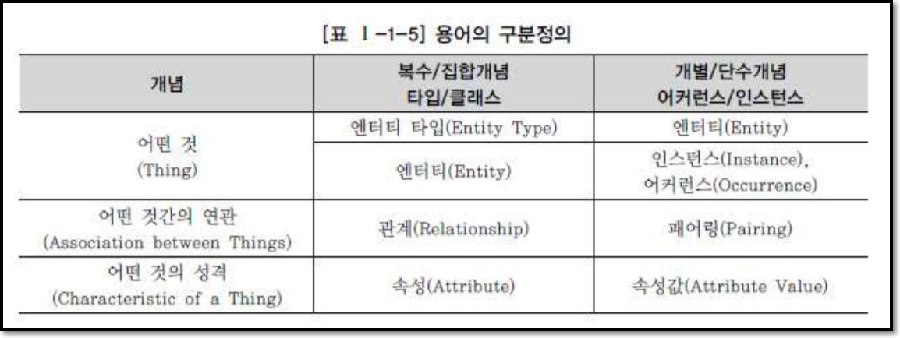

# 데이터 모델의 이해

## 1. 모델링의 이해

### 가. 모델링의 정의
 - 모델링 : 복잡한 현실세계를 일정한 표기법에 의해 표현하는 일
 - 모델 : 현실 세계의 추상화된 반영

### 나. 모델링의 특징
 - `추상화` : 일정한 형식에 맞추어 현실세계 표현
 - `단순화` : 쉽게 이해할 수 있도록 하는 개념
 - `명확화` : 누구나 이해하기 쉽게 정확하게 현상을 기술

### 다. 모델링의 3가지 관점
#### 데이터 관점 `What`
 - 업무가 어떤 데이터와 관련이 있는지
 - 데이터간의 관계는 무엇인지
#### 프로세스 관점 `How`
 - 업무가 실제로 하는 일은 무엇이고 무엇을 해야 하는지
#### 상관 관점 `Data vs Process`
 - 업무가 처리하는 일의 방법에 따라 데이터는 어떻게 영향을 받고 있는지 모델링하는 방법

## 2. 데이터 모델의 기본 개념의 이해

### 가. 데이터 모델링의 정의
 - SQL문장을 어떻게 구성할지에 대한 지식과 효율적인 구성에 대한 밑바탕의 지식을 쌓기 위한 핵심 이론
 - 해당 업무에 어떤 데이터가 존재하는지
 - 업무가 필요로하는 정보는 무엇인지
 - 기업 업무에 대한 종합적인 이해 바탕
 - 정보시스템 구축의 대상이 되는 업무 내용을 정확하게 분석
 - 개발 및 데이터관리에 사용하기 위해

### 나. 데이터 모델이 제공하는 기능
 - 가시화
 - 구조화
 - 문서화

## 3. 데이터 모델링의 중요성 및 유의점
`중요성`
### 가. 파급효과(Leverage)
 - 데이터 설계 구조의 변경으로 인한 전체 시스템 구축 프로젝트에 큰 영향. 위험요소

### 나. 복잡한 정보 요구사항의 간결한 표현(Conciseness)
 - 많은 관련자들이 설계자의 생각대로 정보요구사항을 이해하고 이를 운용할 수 있는 어플리케이션을 개발하고 데이터 정합성을 유지할 수 있도록 정보 요구사항이 정확하고 간결하게 표현되어야 한다.

### 다. 데이터 품질(Data Quality)
 - 데이터는 기업의 중요한 자산
 - 그런데 이런 데이터가 정확성이 떨어진다면?
 - 그저 그런 데이터라면?
 - 데이터 품질의 문제는 데이터 구조의 문제로부터 야기된다.
    - ex)동일한 데이터를 통함하지 않고 분리하여 데이터 불일치 야기

`데이터 모델링 유의점`
 1) 중복(Duplication)
 2) 비유연성(Inflexibility) : 데이터 정의를 데이터 사용 프로세스와 분리하기
 3) 비일관성(Inconsistency) : 데이터 모델링 시 데이터와 데이터간 상호 연관 관계에 대하여 명확하게 정의하기

## 4. 데이터 모델링의 3단계 진행

### 가. 개념적 데이터 모델링(Conceptual Data Modeling)

- Entity와 그들 간의 관계 발견하기 : `ER 다이어그램`

### 나. 논리적 데이터 모델링(Logical Data Modeling)

- 데이터 모델링이 최종적으로 완료된 상태라고 정의할 수 있다.
- 물리적 스키마 설계를 하기 전 단계의 '데이터 모델' 상태
- 정규화가 중요한 활동이다. 일관성 확보, 중복 제거
- 식별자 확정, 정규화, M:M관계해소, 참조 무결성 규칙 정의

### 다. 물리적 데이터 모델링(Physical Data Modeling)
 - 논리 데이터 모델이 데이터 저장소로서 어떻게 컴퓨터 하드웨어에 표현될 것인가

## 5. 프로젝트 생명주기(Life Cycle)에서 데이터 모델링

## 6. 데이터 모델링에서 데이터독립성의 이해
### 가. 데이터독립성의 필요성
 - 유지보수 비용 절감
 - 데이터 중복성 감소
 - 데이터복잡도 감소
 - 요구사항 대응 향상

### 나. 데이터베이스 3단계 구조
 - 외부 단계 : `External Schema`
 - 개념적단계 : `Conceptual Schema`
 - 내부적단계 : `Internal Schema`

### 다. 두 영역의 데이터독립성
 - 논리적 독립성
 - 물리적 독립성

즉, 변경되어도 영향을 안받게 하자라는 말이다.

### 마. 사상(Mapping)
 - 상호 독립적인 개념을 연결시켜주는 다리를 뜻한다.
 - 외부적/개념적 사상(논리적 사상)
 - 개념적/내부적 사상(물리적 사상)

## 7. 데이터 모델링의 중요한 3가지 개념
### 가. 데이터 모델링의 3가지 요소
 - 업무가 관여하는 어떤 것 `Things`
 - 어떤 것이 가지는 성격 `Attributes`
 - 업무가 관여하는 어떤 것 같의 관계 `Relationships`

즉, 엔터티, 속성, 관계

### 나. 단수와 집합(복수)의 명명

## 8. 데이터 모델링의 이해관계자
### 가. 이해관계자의 데이터 모델링 중요성 인식
 - 프로그래밍 언어도 중요하지만 데이터 모델링도 중요하다!
### 나. 데이터 모델링의 이해관계자
 - 누가 데이터 모델링을 학습해야하는가?
 - 코딩만 하는 IT 기술자
 - IT 기술에 종사하거나 전공하지 않았더라도 정보화 추진하는 위치에 있는 사람 : 의사소통을 위해

## 9. 데이터 모델의 표기법인 ERD의 이해
### 가. 데이터 모델 표기법

### 나. ERD(Entity Relationship Diagram) 표기법을 이용하여 모델링하는 방법
 1. 엔터티를 그린다
 2. 엔터티를 적절하게 배치한다
 3. 엔터티간 관계를 설정한다.
 4. 관게명을 기술한다.
 5. 관계의 참여도를 기술한다.
 6. 관계의 필수여부를 기술한다.

## 10. 좋은 데이터 모델의 요소
### 가. 완전성(Completeness)
 - 업무에서 필요로하는 모든 데이터가 데이터 모델에 정의되어 있어야 한다

### 나. 중복배제(Non-Redundancy)
 - 하나의 데이터베이스 내에 동일한 사실은 반드시 한 번만 기록하여야 한다.

### 다. 업무규칙(Business Rules)
 - 수많은 업무규칙을 데이터 모델에 표현하고 데이터 모델을 활용하는 모든 사용자에게 공유 및 제공

### 라. 데이터 재사용(Data Resuability)
 - 재사용성을 향상시키고자 한다면 데이터의 통합성과 독립성에 대해서 충분히 고려해야 한다.