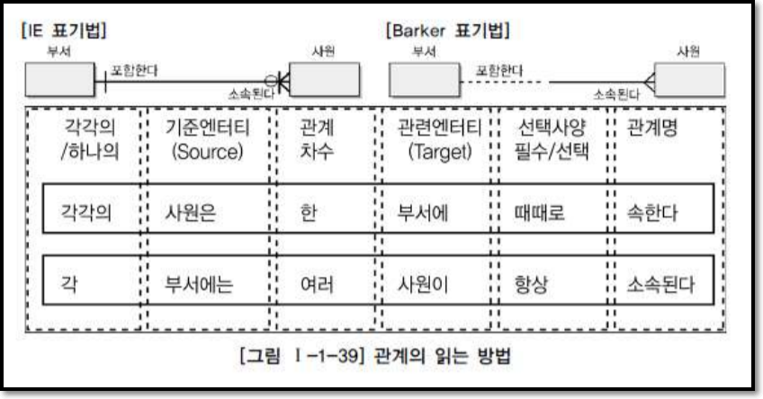

# Entity
 - 강사

## Attribute
 - 이름
 - 주소
 - 생년월일
 - 계약일자
 - 전문분야

## Instance
 - 김길동/경기도/10월/2010년/국어
 - 오리동/서울/4월/2014년/수학
 - 홍길동/부산/9월/2012년/영어

...


## Relationships
 - Entity 강사
 - Entity 수강생
 - `강사`는 `수강생`을 가르친다



<hr>

### Entity 특징
 - 반드시 해당 업무에서 필요하고 관리하고자 하는 정보여야 한다.
 - 유일한 식별자에 의해 식별이 가능해야 한다.
 - 영속적으로 존재하는 인스턴스의 집합이어야 한다. 2개이상
 - 업무 프로세스에 의해 이용되어야 한다.
 - 반드시 속성이 있어야 한다.
 - 다른 엔터티와 최소 1개 이상의 관계가 있어야 한다.

### Entity 분류
 - 유무형에 따른 분류
   - 유형엔터티 : 사원, 물품, 강사
   - 개념엔터티 : 조직, 보험상품
   - 사건엔터티 : 주문, 청구, 미납

 - 발생시점에 따른 분류
   - 기본/키엔터티(Fundamental Entity, Key Entity)
```
그 업무에 원래 존재하는 정보
독립적인 생성 가능
부모의 역할

사원, 부서, 고객, 상품, 자재 등
```
   - 중심엔터티(Main Entity)
```
기본엔터티로부터 발생됨
업무에 있어서 중심적인 역할
데이터의 양이 많이 발생

계약, 사고, 예금원장, 청구, 주문, 매출 등
```
   - 행위엔터티(Active Entity)
```
두 개 이상의 부모엔터티로부터 발생
자주 내용이 바뀌거나 데이터양이 증가

주문목록, 사원변경이력 등
```

### Attribute 특징
 - 업무에서 필요로한다.
 - 의미상 더이상 분리되지 않는다.
 - 엔터티를 설명하고 인스턴스의 구성요소가 된다.

### Attribute 분류
#### 속성 특성에 따른 분류
 - 기본속성(Basic -)
```
업무상 필요한 데이터

엔터티를 식별하기 위해 부여된 일련번호X
코드성 데이터X
다른 속성을 계산하거나 영향을 받아 생성된 속성X

제품이름
제조년월
제조원가
```
 - 설계속성(Designed -)
```
업무를 규칙화하기 위해서

약품용기코드
```
 - 파생속성(Derived -)
```
다른 속성에 영향을 받아 발생하는 속성, 보통 계산된 값들

이자률
```
#### 엔터티 구성방식에 따른 분류
 - PK, FK

##### Attribute 도메인(Domain) : 각 속성이 가질 수 있는 범위

##### Attribute 명명
 - 약어 금지, 서술식 금지