# 식별자
 - Primary Identifier `PK`
 - Alternate Identifier `UK`
 - Foreign Identifier `FK`
 - 복합 식별자 : 여러 식별자가 합쳐짐

## 특징
 - 유일성
 - 최소성
 - 불변성
 - 존재성

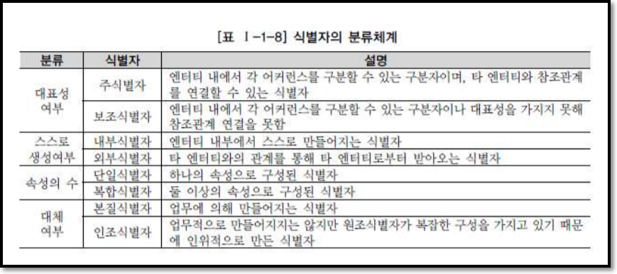

## PK 도출 기준
 - 해당 업무에서 자주 이용되는 속성
 - 명칭, 내역 등과 같이 이름은 nono
 - 복합일 경우 너무 많은 속성 nono plz

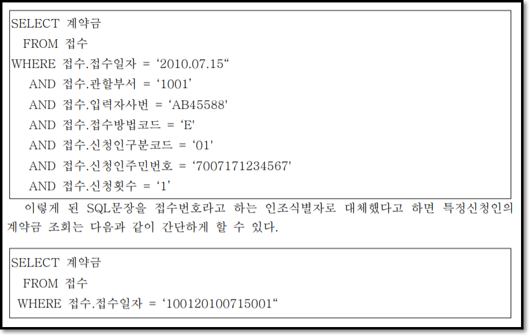

## 식별관계와 비식별관계

### 식별관계
 - 부모로부터 받은 식별자를 자식엔터티의 주식별자로 이용하는 경우에는 Null값이 오면 안된다.
 - 이 경우 부모가 있어야 자식이 생성되는 경우
 - 1:M 혹은 1:1 관계가 형성된다.
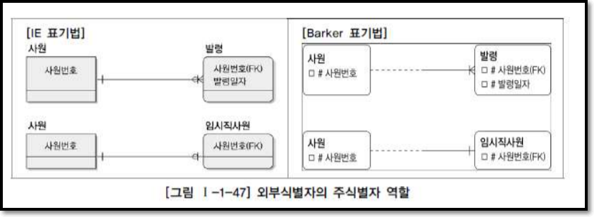

### 비식별관계
 - 부모 없는 자식이 생성이 될 수도 있음
 - 자식만 남겨두고 부모가 소멸 가능
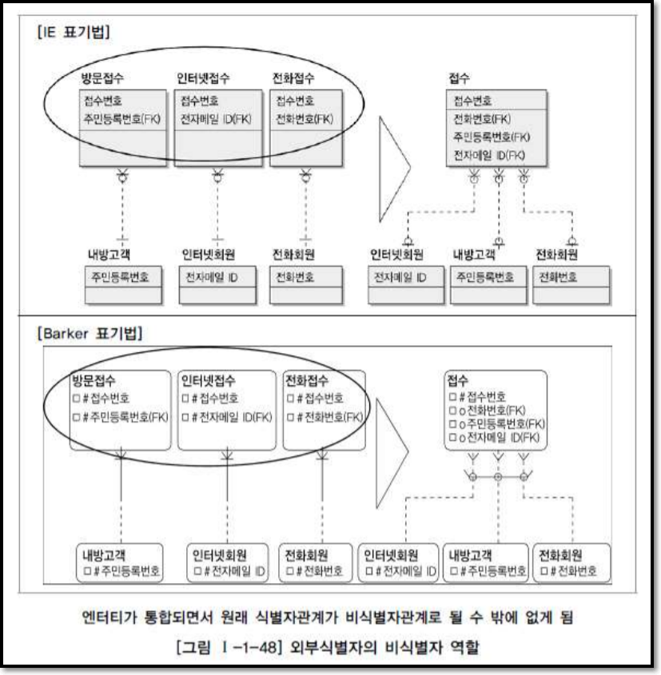

### 식별관계의 문제
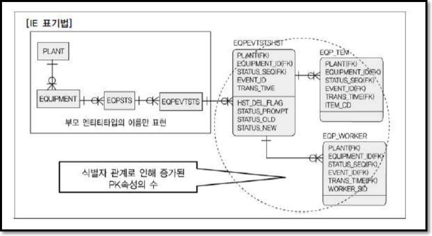

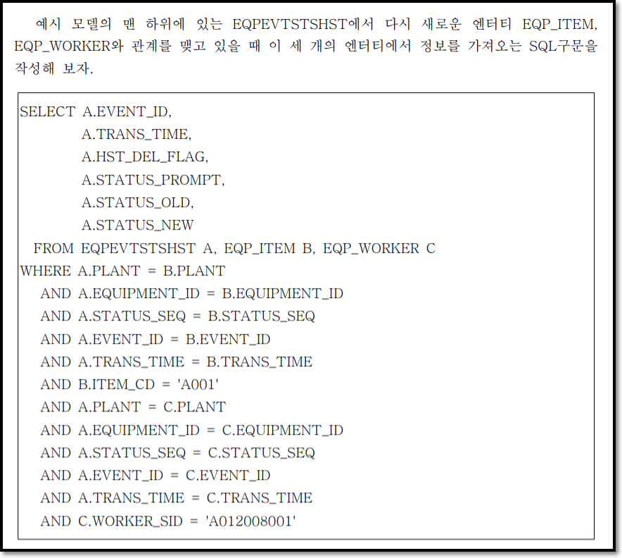

### 비식별관계의 문제

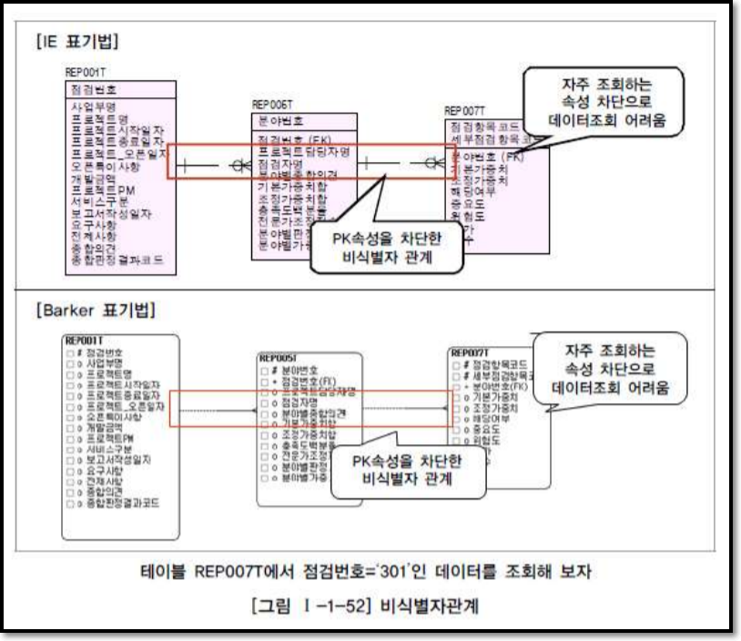

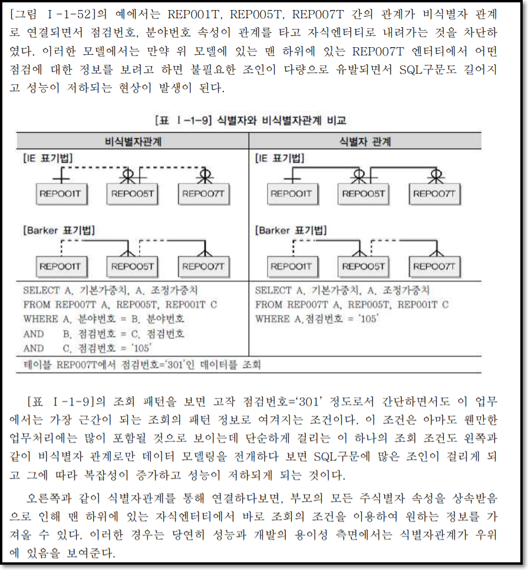

### 식별관계 - 비식별관계 선택하기

#### 균형을 유지하자

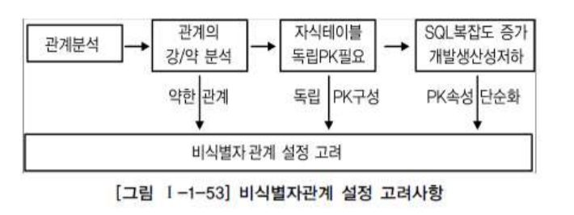

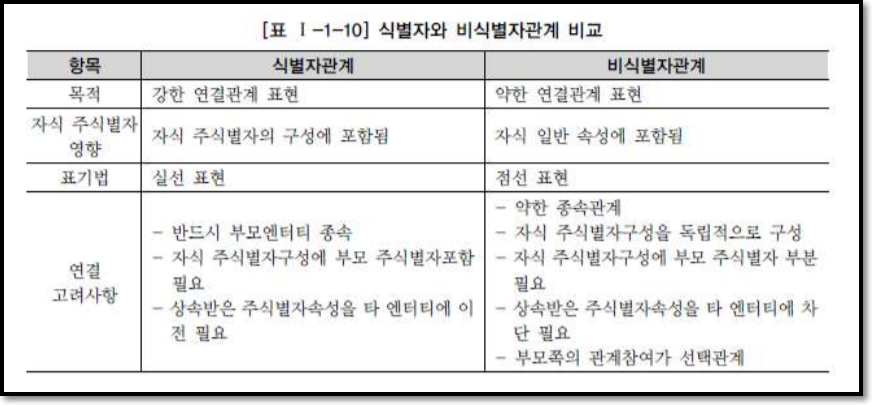

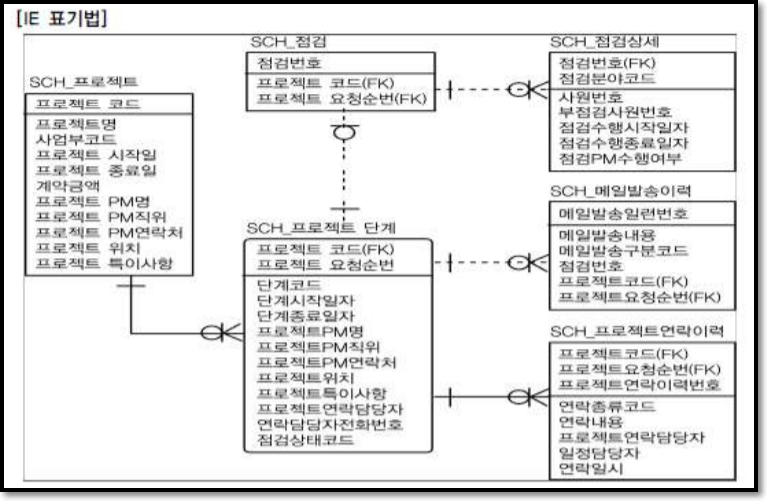
