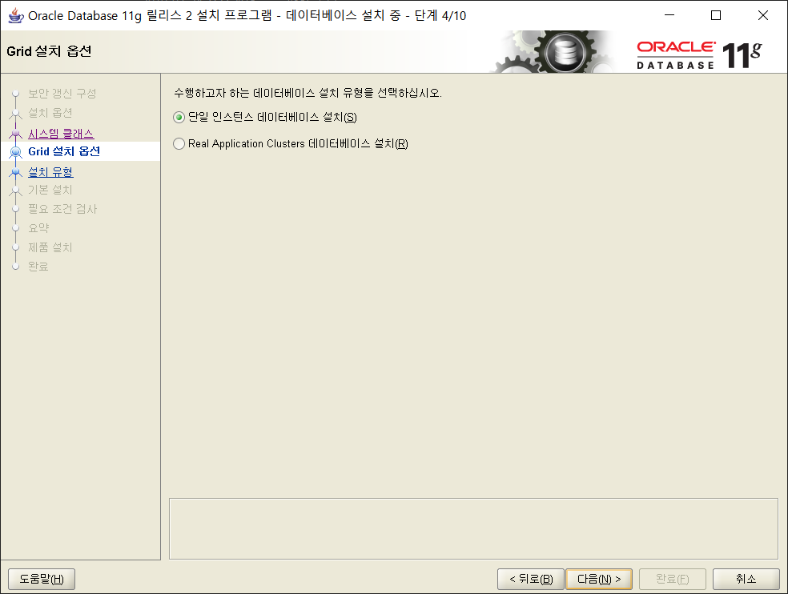
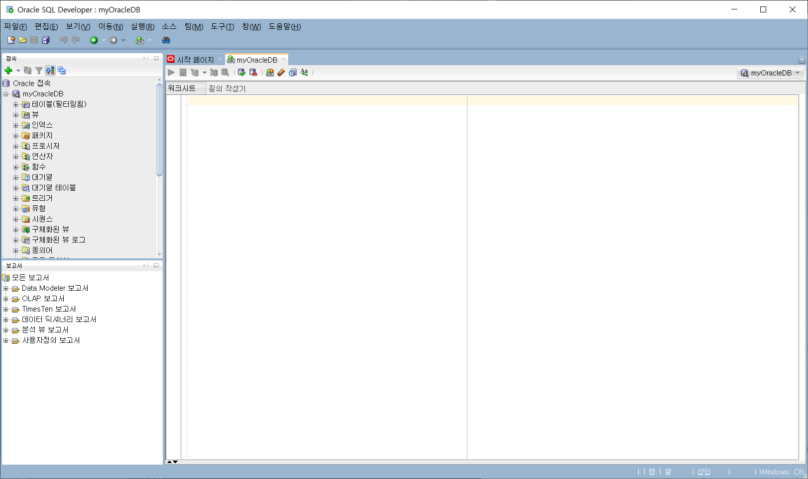

# OracleDB 설치하기

## Oracle Database 11g 설치하기
[11g 다운로드 사이트로 이동하기](https://www.oracle.com/kr/database/technologies/oracle-database-software-downloads.html#11g)

#### [알림]오라클 계정 로그인 필요!!!

 - 자신의 컴퓨터 환경에 맞춰서 다운로드 받기<br>
예를 들면 window 64bit 환경이라면 아래와 같이


 - 두 개의 압출 파일을 받았다면 압축해제
 - database라는 폴더를 합쳐줘야함

*`Setup.exe` 클릭!*
 - 하이~ 


 - 묻지도 따지지도 말고 그냥 다음


 - 예예예


 - 다음


 - 학습용도이기 때문에 데스크톱이든 서버든 상관없음. 필자는 서버로 함. 다음.


 - 또 다음


 - Daum


 - 비밀번호는 간단하게


 - 응~ 계속할꺼야~ [예]


 - [완료]


 - 인내의 시간... 음악 2곡 들으니까 마무리됬습니당


 - 자 이제 오라클 서버가 설치가 되었는데, 아래를 보면 포트번호 1158의 DB 서버주소가 나온다.


 - 진짜 끝! [닫기]


 - 이제 설치여부를 확인해보자. [실행] - `cmd`를 입력해서 아래와 같은 명령어(sqlplus)가 먹히는지 보자
 
 #### sqlplus? 오라클에서 제공하는 DBMS에 접근하는 툴 개념으로 보자


 - [실행] - `services.msc` 입력


 - Oracle관련 서비스들이 돌아가는게 보일 것이다.


## SQL Developer 설치하기
음... 사실 위와 같이 `cmd`와 같은 터미널을 이용해서 SQL작업을 할 수 있기는 한데, 시각적으로 보기도 힘들고 작업 시간도 많이 걸리고 불편한게 사실이다. 그래서 SQL Developer를 이용해 SQL작업을 하자. 

[SQL Developer 다운로드 사이트로 이동하기](https://www.oracle.com/tools/downloads/sqldev-downloads.html)

#### [알림]오라클 계정 로그인 필요!!!

압축을 푼 후에 `sqldeveloper.exe`를 실행

#### SQL Developer는 Java 기반으로 돌아갑니다.
 - 실행할 때 나오는 로딩 화면


 - 이제 데이터베이스를 만들어 실습을 해보자


 - 데이터베이스 Name과 내가 만들고 싶은 사용자 이름과 비밀번호를 입력하고 [테스트] 버튼을 눌러보자
 - 그러나 발생한 에러... 왜 그럴까? 이유는 바로 해당하는 사용자 이름을 생성한 적도 없고, 저런 사용자 이름은 존재하지 않기 때문이다.


먼저 사용자에 대한 관련 명령어와 컨셉을 익히자.

### 오라클 사용자 관리에 관해

오라클 데이터베이스를 설치한 후 자동으로 생성되는 사용자 계정은 다음과 같다.

| 사용자이름 | 설명 |
|:---:|:---:|
| `SYS` | 오라클 슈퍼 사용자로 데이터베이스에서 발생하는 모든 문제를 처리할 수 있는 권한을 가짐. |
|`SYSTEM`| 오라클 데이터베이스를 유지. 보수할 때 사용하는 사용자. 
|        | SYS와 달리 데이터베이스를 생성할 권한을 가지지 않음. |
| `SCOTT` | 샘플 사용자 |

#### *사용자 관리 관련 명령어 익히기*
 - [실행] - `cmd` 입력 (`윈도우키+E`를 누르면 보다 간편하게 실행창을 띄울 수 있다.)
 - `sqlplus` 입력 후 아래 절차 진행
```sql
사용자명 입력 : SYSTEM
비밀번호 입력 : (11g설치할 때 설정한 비밀번호)

다음에 접속됨:
Oracle Database 11g Enterprise Edition Release 11.2.0.1.0 - 64bit Production
With the Partitioning, OLAP, Data Mining and Real Application Testing options

SQL>
--- 여기까지 일단 띄어보자 ---
```

오라클에서 기본으로 제공되는 사용자 계정 조회 query
```sql
SELECT * FROM all_users;
```
결과를 보면 알 수 있듯이 DB 시스템 관련 설정 권한을 가지고 있는 관리자용 사용자 뿐만아니라 SQL 연습을 위한 샘플 사용자 목록들도 볼 수 있다. 예를 들어 `HR`은 회사 인사과가 쓰는 테이블 샘플들이 미리 만들어져 있어서 별도로 테이블을 만드는 수고(~~창작의 고통~~) 필요없이 SQL 연습을 할 수 있다.

이건 아래에 자세히 더 다루기로 하고 본래 목적인 계정이나 생성해보자


 - 사용자 계정 만들기
```sql
CREATE USER [username] IDENTIFIED BY [password];
```
더 자세한 명령어들을 테스트해볼려면 [여기](./account-command.md)를 클릭하세요

 - 데이터베이스를 만들어 실습을 해보자(재시도)


계정이 생성되었으나 또 에러가 뜬다. 이유는?

```
사용자명 입력: rhie
비밀번호 입력:
ERROR:
ORA-01045: user RHIE lacks CREATE SESSION privilege; logon denied
```
CREATE SESSION 권한 부여가 필요하다... 여기서 발생하는 걱정은 분명 다양한 권한들이 있을텐데 권한으로 인한 에러가 발생할 때마다 관리자 계정으로 들어가 일일이 권한을 부여하는게 여간 귀찮은게 아니다.

... 그냥 오라클에서 제공하는 기본 계정을 사용하자 ^^... 지금 중요한건 SQL 실습하는 것이 아니겠는가?

 - 연습용 계정 중 하나인 `scott`로 접속하기


또 에러가 걸렸다. 후... 원인은 아래와 같다.
```
사용자명 입력: scott
비밀번호 입력:
ERROR:
ORA-28000: the account is locked
```
계정 잠금을 풀어주자

 - `scott` 계정 잠금 풀기

`SYSTEM`계정으로 다시 접속한 후 `scott`계정 잠금을 푸는 명령어를 입력
```
사용자명 입력: SYSTEM
비밀번호 입력:

다음에 접속됨:
Oracle Database 11g Enterprise Edition Release 11.2.0.1.0 - 64bit Production
With the Partitioning, OLAP, Data Mining and Real Application Testing options

SQL> alter user scott account unlock;

사용자가 변경되었습니다.
```

 - `scott` 계정에 접속한 후 비밀번호 변경해주기

`scott`이란 연습용 계정의 비밀번호는 **tiger** 입니다.
```
사용자명 입력: scott
비밀번호 입력:
ERROR:
ORA-28001: the password has expired


scott에 대한 비밀번호를 변경합니다.
새 비밀번호:
새 비밀번호 다시 입력:
비밀번호가 변경되었습니다.

다음에 접속됨:
Oracle Database 11g Enterprise Edition Release 11.2.0.1.0 - 64bit Production
With the Partitioning, OLAP, Data Mining and Real Application Testing options

SQL>
```

- 연습용 계정 중 하나인 `scott`로 접속하기(제발)


이번에도 에러... 어라..? 잠깐만.. 왜 SID가 xe로 설정되어있지..? ㅋㅋㅋㅋㅋ 알다시피 우리는 설치할 때 orcl로 하지 않았는가


xe를 orcl로 바꿔주자 ^^...


성공이닷~!!! 이제 [저장]을 하자


 - 왼쪽에 `myOracleDB`가 생겼다. 이걸 누르면 계정 정보를 입력하는 창이 나온다.


 - 계정 접속에 성공하였다. SQL 명령어를 입력하는 창이 나왔다.



 - 다음 명령어를 써보자. 아래와 같이 query가 되면 성공!

```sql
SELECT * FROM dept;
```

<hr>

## 만일 `scott` 계정을 초기화 시키고 싶다면?

SQL 연습으로 인해 난장판이 된 테이블들을 다시 원래 상태로 돌리고 싶을 것이다. 한가지 예로, 오라클 설치시에 기본적으로 제공되는 SCOTT 계정에는 BONUS, DEPT, EMP, SALGRADE의 4개의 기본테이블이 존재하는데, 이 테이블을 생성하는 **`.sql`** 파일을 찾아서 SQL문을 실행시키면 된다.

**C:\app\quoti\product\11.2.0\dbhome_1\RDBMS\ADMIN**

설치 및 컴퓨터 환경에 따라 다르겠지만 보통 초기화 **`.sql`** 파일들은 여기에 모여 있다. 그리고 `scott.sql`를 찾으면 된다.


scott 계정으로 접속한다음 다음과 같은 명령어를 치면 된다.
```
@C:\app\{사용자이름}\product\11.2.0\dbhome_1\RDBMS\ADMIN\scott.sql
```
